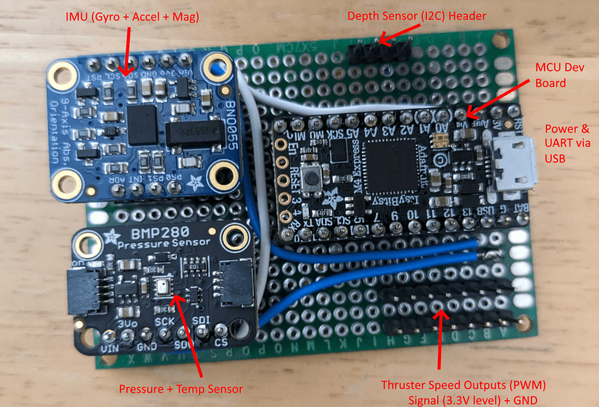

# AquaPack Robotics Control Board

TODO: goal and purpose

## Components

*Note: Development boards and breakout boards were selected to minimize development time.*

- Adafruit ItsyBitsy M4 Express Development Board
    - Cortex M4 CPU capable of 32-bit integer math and includes hardware multiplier and divider
    - Cortext M4 CPU has a hardware floating point unit
    - The above two features help reduce software complexity making the firmware easier to maintain, debug, and develop
- Adafruit BNO055 Breakout
    - 9DOF IMU (Gyro + Accel + Mag) with good quality sensors
    - Includes an on-chip processor running sensor fusion algorithms and can provide useful information such as a gravity vector or an orientation in 3D space.
    - These features remove the need to develop sensor calibration, fusion, and interpretation algorithms in the control board firmware (simplifies firmware and accelerates development time)
    - Can also provide raw sensor data meaning custom algorithms are still possible if deemed necessary / beneficial at a later time
- Adafruit BMP280 Breakout
    - Pressure and temperature sensor
    - Not likely to be used if on-chip calibrations of BNO055 are used, however some sensor calibration algorithms take into account temperature and pressure. This is present in case this information is needed at a later date.
    - Can also be used to detect abnormal conditions (eg over temperature)

## Assembly

Prototype is assembled on protoboard. Final assembled prototype is shown below.

### Assembly Instructions

1. Solder female header strips in the positions shown below. This avoids soldering breakouts / dev boards directly to protoboard which allows easily replacing components if needed (or reusing them for other purposes later).

TODO: Picture

2. Wire SDA and SCL wires from MCU board to each sensor as shown below

TODO: Table

TODO: Picture

3. Wire power and ground to each sensor as shown below. Power comes from USB on MCU dev board through builtin regulator.

TODO: Table

TODO: Picture

4. Wire PWM signal header pins to GPIO pins on the dev board

TODO: Table

TODO: Picture