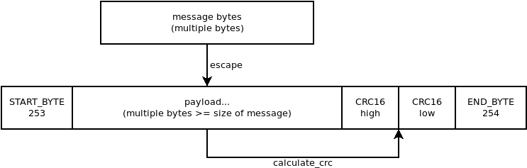

# AquaPack Robotics Control Board

The control board is a replacement for the Cube Orange / Pixhawk running ArduSub that was originally used on SeaWolf VIII. The control board was developed to address continuous issues with both control and sensors when using either off the shelf autopilot.

The control board is designed using development boards and breakout boards to reduce development time and simplify maintenance / modifications later. This is not a size-optimized solution (and does not need to be).

The control board generates ESC control signals (PWM), acquires and processes sensor data (using onboard IMU / IMUs, depth sensor, and sensor fusion / filtering algorithms) as well as running control loops for system motion and stability control. Additionally, an interface to the computer (Jetson) is provided to acquire sensor data and allow control of motors using high or low level methods (vectored motion or direct control of each motor’s speed).

## Firmware Development Environment

Both the [control board firmware](./firmware/) and the [hardware test](./hwtest/) program are developed using [PlatformIO](https://platformio.org/). PlatformIO is installed as an extension to [VSCode](https://code.visualstudio.com/).

## Flashing a New Board

1. [Update the U2F Bootloader](https://learn.adafruit.com/introducing-adafruit-itsybitsy-m4/update-the-uf2-bootloader)
    - Press the reset button twice to enter bootloader mode
    - Copy the downloaded bootloader `.u2f` file to the `ITSYM4BOOT` drive

2. Upload the Hardware Test Program (`hwtest`)
    - Open the `hwtest` folder in VSCode (after installing platformio extension)
    - Upload the project using the upload button on the toolbar
    - The port should be automatically detected. If not, [specify it](https://docs.platformio.org/en/latest/projectconf/section_env_upload.html) in `platformio.ini`
    - The hardware test will not begin until a serial connect is opened with the board. Open the serial monitor and make sure all tests pass. The red LED will turn off when successful, or blink on failure.

3. Upload the firmware
    - Open the `firmware` folder in VSCode (after installing platformio extension)
    - Upload the project using the upload button on the toolbar
    - The port should be automatically detected. If not, [specify it](https://docs.platformio.org/en/latest/projectconf/section_env_upload.html) in `platformio.ini`

## Control Board Usage

### General Configuration

TODO

### Modes of Operation

TODO

### Communication Protocol

Communication with the control board is defined by three layers
- Hardware communication layer: How bytes are sent at a hardware level and how this is abstracted by a PC
- Message format and construction: How arbitrary data is composed into an identifyable message
- Command / message set: What the data of a message should actually be to perform different tasks

#### Hardware Communication Layer

Messages are sent to the control board over the ItsyBitsy M4's builtin USB port. The control board acts as a USB ACM CDC device. In practice, this means that it shows up as a serial (UART) port on the computer it is connected to. However, baud rate settings are irrelevant (and changing baud rates has no effect). As such, messages are sent to / received from the control board using "UART" with an undefined baud rate (most software stacks require selecting any baud rate; it will not be applied lower level).

#### Message Format and Construction

The messages sent to / received from the control board have a specific format. Each message is a raw set of bytes (unsigned byte array). This set of bytes is the "payload data" of the message. The "payload data" is the data that is contained within a single message.

To be able to identify what data is part of a single message, it is necessary to add some additional information around the payload. The control board uses a special byte to indicate the start of a message (`START_BYTE`) and another one to identify the end of a message (`END_BYTE`). 

Since the payload could itself contain a start or end byte, there is also an escape byte (`ESCAPE_BYTE`) used to escape a `START_BYTE`, `END_BYTE`, or an `ESCAPE_BYTE` in the payload. 
- `START_BYTE` becomes `ESCAPE_BYTE`, `START_BYTE`
- `END_BYTE` becomes `ESCAPE_BYTE`, `END_BYTE`
- `ESCAPE_BYTE` becomes `ESCAPE_BYTE`, `ESCAPE_BYTE`

This is similar to escaping a quote in a string using a backslash.

For the control board:
- `START_BYTE` = 253 (unsigned 8-bit) = -3 (signed 8-bit)
- `END_BYTE` = 254 (unsigned 8-bit) = -2 (signed 8-bit)
- `ESCAPE_BYTE` = 255 (unsigned 8-bit) = -1 (signed 8-bit)

Additionally, each message contains a 16-bit CRC for the payload data (CCITT algorithm). This CRC is calculated on the original (unescaped) payload data (no start byte, end byte, etc). The CRC is appended (big endian) to the message just after the payload (just before `END_BYTE`). When the other side receives the message it can calculate the CRC of the received payload and compare it to the received crc. If the crc values match, the message is not corrupt.

    

### Commands and Messages

The following are the messages sent to the control board or received from the control board and what they mean / do. These messages are the *payload* in the message format described above.

TODO

