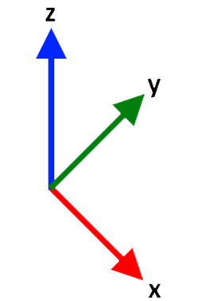
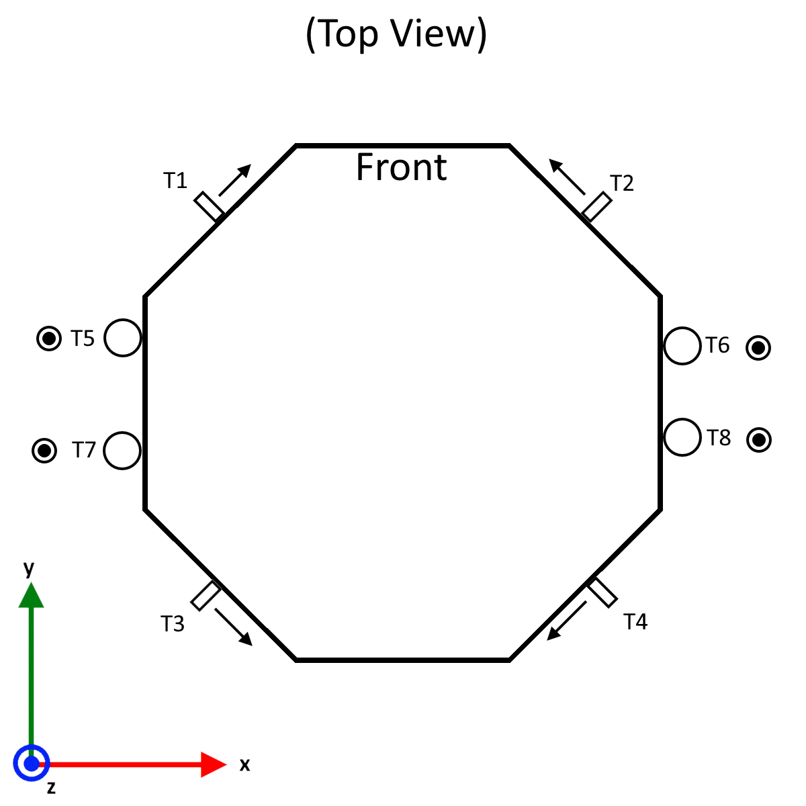
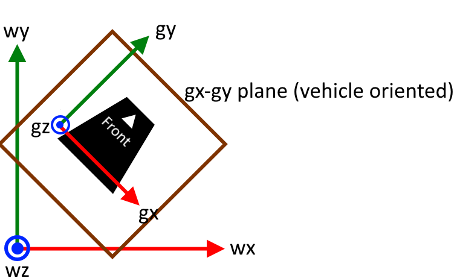
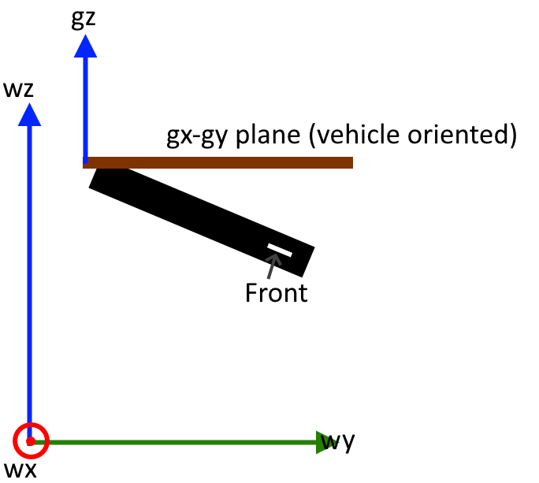
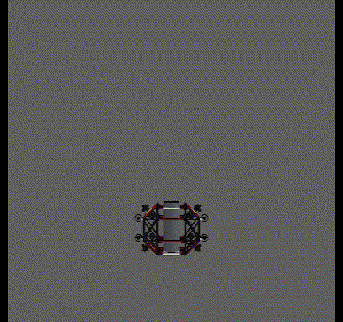

# Math

## Coordinate System Definition

The control board uses a coordinate system that is somewhat non-standard.

- The coordinate system is right handed
- `+y` is forward, `+z` is up, `+x` is right
- Pitch is about x, roll is about y, yaw is about z

<center>
{: style="height:250px;"}
{: style="height:250px;"}
{: style="height:250px;"}
</center>

While this coordinate system may seem strange to some (especially those who have worked with aircraft), the name of axes doesn't really matter. The definition of pitch, roll, and yaw relative to the front / top of the vehicle remain standard.

## 6 Degree of Freedom Motion Control


### Nomenclature, Notation, and Convention Notes

1. Matrices are assumed to be zero indexed (not 1 indexed). This means the first element of a matrix $M$ is $m_{00}$ not $m_{11}$. This is because the math will be implemented in C (which uses zero indexed arrays).
2. Thruster numbers (1-8) are used by the control board's user facing components. However, this math will use thruster indices (0-7) where `index = number - 1`. This is again because arrays in C are zero indexed.
3. Rotations about axes (angular velocities / DoFs) are referred to as "xrot" (about x), "yrot" (about y), and "zrot" (about z).
4. The terms "pitch", "roll", and "yaw" are used to describe the vehicle's orientation in space. These are a set of intrinsic Euler angles (Tait-Bryan angles to be precise) composed in the order yaw then pitch then roll (z-x'-y'' in the control board's coordinate system). Note that while these do follow the standard meanings of pitch, roll, and yaw relative to the vehicle, the axes have non-standard names. Thus, you cannot simply use standard formulas for converting between quaternions and pitch, roll, yaw.
5. Velocities in DoFs are normalized (meaning -1.0 to 1.0).
6. Euler angles are represented as a set of three values $\begin{pmatrix} pitch & roll & yaw\end{pmatrix}$
7. Quaternions are represented either as a combination of a scalar component, $s$, and a vector component, $v$ as $\{s,v\}$ or they may be represented using the names $w$, $x$, $y$, and $z$. In such a case this is equivelent to $\{w, (x, y, z)\}$. In other words, $x$, $y$, and $z$ are the components of the vector $v$ and $w=s$.
8. The conjugate of a quaternion, $q$ is denoted $q^*$


### System Assumptions

- Vehicle is capable of motion exclusively in each of 6 degrees of freedom (DoFs). These are three translational DoFs, and three rotational DoFs.
- The vehicle's speed in positive and negative directions are roughly equal for each DoF.
- Thruster orientations are fixed. Gimbaled thruster vehicles are not supported.
- At most 8 thrusters (less is fine)
- System has 3D orientation information
- System has depth information
- System does **not** have translational position information


### Example Vehicle

The examples on this page will use AquaPack robotics's [SeaWolf VIII robot](https://ncsurobotics.github.io/SW8-Documentation/). This robot's thruster configuration is as shown below.

<center>
{: style="height:400px;"}
</center>

The arrows indicate the direction the thruster moves water when powered in the positive direction. These arrows are opposite the direction force is excerpted on the vehicle. Note that the diagram above uses thruster numbers, not indices.

### DoF Matrix

The *DoF Matrix*, $D$, is constructed based on the vehicle's thruster configuration. Rows of the matrix correspond to thrusters (by index). And columns of the matrix correspond to vehicle-relative DoFs. Thus, this is an 8x6 matrix (8 thrusters, 6 DoFs). Columns correspond to DoFs in the following order (0-5): x, y, z, xrot, yrot, zrot.

$D = \left(\begin{array}{c|c|c|c|c|c} d_0 & d_1 & d_2  & d_3 & d_4 & d_5 \end{array}\right) = \left(\begin{array}{c|c|c|c|c|c} d_x & d_y & d_z  & d_{xr} & d_{yr} & d_{zr} \end{array}\right)$

Each column of the DoF matrix, $d_i$ is a set of thruster speeds that result in motion *exclusively* in the column's DoF. Additionally, the resultant motion should be the maximum possible speed, and in the positive direction. Each $d_i$ is an 8 element column vector, with elements corresponding to thrusters (by index). All speeds should be normalized (between -1.0 and 1.0)

For the example vehicle shown above, the following is the DoF matrix

$D = 
\begin{pmatrix}
-1 & -1 & 0 & 0 & 0 & +1 \\
+1 & -1 & 0 & 0 & 0 & -1 \\
-1 & +1 & 0 & 0 & 0 & -1 \\
+1 & +1 & 0 & 0 & 0 & +1 \\
0 & 0 & -1 & -1 & -1 & 0 \\
0 & 0 & -1 & -1 & +1 & 0 \\
0 & 0 & -1 & +1 & -1 & 0 \\
0 & 0 & -1 & +1 & +1 & 0 \\
\end{pmatrix}$

Consider the first column: $d_0 = d_x$. This column's thruster speeds should result in the vehicle moving as fast as possible in the +x direction (only). This is achieved by setting T2, T4 (index 1, 3) to the positive direction and T1, T3 (index 0, 2) to the negative direction at full speed (recall that the arrows are opposite the direction the thruster excerpts force on the vehicle). Thus

$d_x = \begin{pmatrix}-1 & +1 & -1 & +1 & 0 & 0 & 0 & 0\end{pmatrix}^T$

Note that when constructing the DoF matrix for your vehicle, you should assume an ideal system and environment (ignore variation between thrusters, environmental factors that create motion, etc).


### LOCAL Mode Motion

In LOCAL mode, motion is specified as a set of speeds in vehicle-relative DoFs. The user provides the control board with a *local target motion vector* ($t_l$) where each element corresponds to a DoF.

$t_l = \begin{pmatrix} x & y & z & r_x & r_y & r_z \end{pmatrix}^T$

$x$ is normalized velocity in +x direction  
$y$ is normalized velocity in +y direction  
$z$ is normalized velocity in +y direction  
$r_x$ is normalized angular velocity about the +x axis direction (xrot)  
$r_y$ is normalized angular velocity about the +y axis (yrot)  
$r_z$ is normalized angular velocity about the +z axis (zrot)

By multiplying this target motion by the DoF matrix, $D$, a *speed vector* $s$ is obtained where each element of $s$ corresponds to a specific thruster (by index).

$s = D t_l$

Consider the example where $t_l = \begin{pmatrix}0 & 1 & 0 & 0 & 0 & 0\end{pmatrix}^T$. This should cause the vehicle to move at full possible speed forward (relative to the vehicle's orientation).

$s = D t_l = 
\begin{pmatrix}
-1 & -1 & 0 & 0 & 0 & +1 \\
+1 & -1 & 0 & 0 & 0 & -1 \\
-1 & +1 & 0 & 0 & 0 & -1 \\
+1 & +1 & 0 & 0 & 0 & +1 \\
0 & 0 & -1 & -1 & -1 & 0 \\
0 & 0 & -1 & -1 & +1 & 0 \\
0 & 0 & -1 & +1 & -1 & 0 \\
0 & 0 & -1 & +1 & +1 & 0 \\
\end{pmatrix}
\begin{pmatrix}0 \\ 1 \\ 0 \\ 0 \\ 0 \\ 0\end{pmatrix}
=
\begin{pmatrix}-1 \\ -1 \\ +1 \\ +1 \\ 0 \\ 0 \\ 0 \\ 0\end{pmatrix}$

In the above example, it is trivial to see that this is the desired motion. However for a more complex example, a problem appears. Consider $t_l = \begin{pmatrix}0 & 1 & 0 & 0 & 0 & 1\end{pmatrix}^T$. This describes the vehicle both moving forward and about the z-axis at full possible speed.

$s = D t_l = 
\begin{pmatrix}
-1 & -1 & 0 & 0 & 0 & +1 \\
+1 & -1 & 0 & 0 & 0 & -1 \\
-1 & +1 & 0 & 0 & 0 & -1 \\
+1 & +1 & 0 & 0 & 0 & +1 \\
0 & 0 & -1 & -1 & -1 & 0 \\
0 & 0 & -1 & -1 & +1 & 0 \\
0 & 0 & -1 & +1 & -1 & 0 \\
0 & 0 & -1 & +1 & +1 & 0 \\
\end{pmatrix}
\begin{pmatrix}0 \\ 1 \\ 0 \\ 0 \\ 0 \\ 1\end{pmatrix}
=
\begin{pmatrix}0 \\ -2 \\ 0 \\ +2 \\ 0 \\ 0 \\ 0 \\ 0\end{pmatrix}$

Notice that the resultant speed vector has motors moving in excess of 100% speed (elements with magnitude greater than 1.0). This is not possible. 

The simple solution would seem to be dividing all elements of the vector by the one with the largest magnitude. This results in a scaled speed vector $\hat{s}$

$\hat{s} = s \div \text{absmax}(s)$

However, this method will not work well in all cases. Consider $t_l = \begin{pmatrix}0 & 1 & 1 & 1 & 1 & 1\end{pmatrix}^T$.

$s = D t_l = 
\begin{pmatrix}
-1 & -1 & 0 & 0 & 0 & +1 \\
+1 & -1 & 0 & 0 & 0 & -1 \\
-1 & +1 & 0 & 0 & 0 & -1 \\
+1 & +1 & 0 & 0 & 0 & +1 \\
0 & 0 & -1 & -1 & -1 & 0 \\
0 & 0 & -1 & -1 & +1 & 0 \\
0 & 0 & -1 & +1 & -1 & 0 \\
0 & 0 & -1 & +1 & +1 & 0 \\
\end{pmatrix}
\begin{pmatrix}0 \\ 1 \\ 1 \\ 1 \\ 1 \\ 1\end{pmatrix}
=
\begin{pmatrix}0 \\ -2 \\ 0 \\ +2 \\ -3 \\ -1 \\ -1 \\ +1\end{pmatrix}$

and

$\hat{s} = s \div \text{absmax}(s) = s \div 3 = \begin{pmatrix}0 \\ -0.67 \\ 0 \\ +0.67 \\ -1 \\ -0.33 \\ -0.33 \\ +0.33\end{pmatrix}$

While this has resulted in an possible set of thruster speeds, these are not optimal. Look at the example vehicle diagram. Notice that thrusters 1-4 and 5-8 control different motions. In the previous example, thrusters 1-4 were slowed down more than necessary, because thruster 5 was too large of a value. This is not ideal as the vehicle's maximum speed becomes artificially limited. Instead, the following $\hat{s}$ is ideal. This is scaling down the thrusters within each group (1-4 and 5-8) separately.

$\hat{s} = \begin{pmatrix}0 \\ -1 \\ 0 \\ +1 \\ -1 \\ -0.33 \\ -0.33 \\ +0.33\end{pmatrix}$

Groupings of thrusters on the example vehicle are easy to observe, however this is not always true. Thus, achieving optimal scaling for any system (any DoF matrix) requires a more sophisticated method to determine groupings and scale speeds.

Thruster groupings are determined by "overlap" between thrusters. Two thrusters, $i$ and $j$ are said to overlap if they have a non-zero entry in the same column of the DoF matrix ($D$) for at least one column. This is easier to calculate using a *contribution matrix*, $C$, defined as $D \neq 0$. This results in a binary form of the DoF matrix. For the above example

$C = 
\left[\begin{pmatrix}
-1 & -1 & 0 & 0 & 0 & +1 \\
+1 & -1 & 0 & 0 & 0 & -1 \\
-1 & +1 & 0 & 0 & 0 & -1 \\
+1 & +1 & 0 & 0 & 0 & +1 \\
0 & 0 & -1 & -1 & -1 & 0 \\
0 & 0 & -1 & -1 & +1 & 0 \\
0 & 0 & -1 & +1 & -1 & 0 \\
0 & 0 & -1 & +1 & +1 & 0 \\
\end{pmatrix}
\neq 0 \right] = 
\begin{pmatrix}
1 & 1 & 0 & 0 & 0 & 1 \\
1 & 1 & 0 & 0 & 0 & 1 \\
1 & 1 & 0 & 0 & 0 & 1 \\
1 & 1 & 0 & 0 & 0 & 1 \\
0 & 0 & 1 & 1 & 1 & 0 \\
0 & 0 & 1 & 1 & 1 & 0 \\
0 & 0 & 1 & 1 & 1 & 0 \\
0 & 0 & 1 & 1 & 1 & 0 \\
\end{pmatrix}$

Then for each thruster $i$ an overlap vector $o_i$ can be constructed as follows

$o_i = C (c^i)^T$

where $c^i$ is the $i$th row of $C$. Thus, $o_i$ is an 8 element vector where each element corresponds to a thruster (by index). Element $j$ of $o_i$ can either be $1$ or a $0$. A $1$ indicates that thrusters $i$ and $j$ overlap.

For example, 

$o_0 = C (c^0)^T = \begin{pmatrix} 1 & 1 & 1 & 1 & 0 & 0 & 0 & 0 \end{pmatrix}^T$

This shows that thruster index 0 (T1) overlaps with indices 0, 1, 2, and 3 (T1, T2, T3, T4).

By calculating and storing these overlap vectors for each thruster ($\left\{o_i\right\}_{i=0}^7$), this effectively forms a lookup table to determine thruster overlap. While this is not the most memory efficient option, it reduces computation time, which is important since this will run very frequently on a microcontroller.

Using overlap vectors, the following algorithm can be used to scale motor speeds:

- Find the thruster (`i`) with the largest magnitude speed
- Iterate over thruster `i`'s overlap vector
- For any thruster, `j`, with which thruster `i` overlaps, divide thruster `j`'s speed by the magnitude of thruster `i`'s speed
- Repeat until the largest magnitude does not exceed 1.0

```
while true
    // m is value, i is index
    m, i = max(abs(speed_vector))
    if m <= 1.0
        // Done scaling
        break
    endif

    // Iterate over all thrusters (0-7 inclusive)
    for j=0...7
        if overlap_vector[i][j] == 1
            // i and j overlap. Divide j's speed by m.
            speed_vector[j] /= m
        endif
    endfor
endwhile
```

This algorithm results in optimal speed scaling by only reducing the speed of thrusters that share DoF contributions.


### GLOBAL Mode Motion

GLOBAL mode is very similar to LOCAL mode, however, motion is described *partially* relative to the world instead of the robot. Specifically, motion of the vehicle is compensated for vehicle pitch and roll (but **not** yaw). This results in a coordinate system defined by the axes `gx`, `gy`, and `gz`. Note that the world coordinate system is defined as `wx`, `wy`, `wz`.





*Notably, if the vehicle is pitched 180 degrees, the gx-gy plane becomes aligned to the back of the vehicle ensuring consistent motion. This is shown in the animation below.*




In GLOBAL mode, the user provides the control board with a *global target motion vector*, $t_g$ with 6 elements. This target motion vector is a concatenation of two 3 dimensional vectors. The first, a set of translations along `gx`, `gy`, and `gz`. Second a set of rotations to affect vehicle pitch, roll, and yaw. These are referred to by the following names

- `x`: Speed in `gx` direction (translation)
- `y`: Speed in `gy` direction (translation)
- `z`: Speed in `gz` direction (translation)
- `p`: Speed at which the vehicle's pitch should increase (negative for decrease pitch). Aka "pitch_spd"
- `r`: Speed at which the vehicle's roll should increase (negative for decrease pitch). Aka "roll_spd"
- `h`: Speed at which the vehicle's yaw should increase (negative for decrease pitch). Aka "yaw_spd"

$t_g = \begin{pmatrix} x & y & z & p & r & h \end{pmatrix}$


It is necessary to transform each DoF's motion into motions in the vehicle's DoFs. These speeds can then be passed to LOCAL mode.

***WARNING:*** *GLOBAL mode is impacted by gimbal lock issues with euler angles. This occurs when the vehicle's pitch is +/- 90 degrees. In this scenario the meaning of "increase / decrease pitch" is ambiguous. The vehicle will take the zero-roll route in this scenario (an arbitrary choice based on how euler angle conversion is implemented in the firmware). Thus, GLOBAL mode may produce undesirable motion if the roll is non-zero and you pitch through +/- 90. A potential solution for this could be some form of motion hysteresis to handle moving through gimbal lock orientations, however this is **not** implemented as of now.*


#### Translation DoFs

The translation DoFs are easily transformed using gravity vectors. By applying a quaternion based rotation matrix to the base gravity vector, $g_b = \begin{pmatrix}0 & 0 & -1\end{pmatrix}$, the following solution is determined for the current gravity vector, $g_c$ given the vehicle's orientation quaternion, $q$.

$\begin{pmatrix} 2*(q.x*q.z+q.w*q.y) \\  2*(q.w*q.x-q.y*q.z) \\ -(q.w)^2+(q.x)^2+(q.y)^2-(q.z)^2\end{pmatrix}^T$

The minimal rotation from $g_b$ to $g_c$ is then calculated. Let this rotation be called $q_{rot}$. *This rotation will generally include no yaw component, unless the vehicle is upside down and facing backwards (eg pitch of 180 degrees) in which case it will contain a yaw component of 180 degrees. This is desirable as it ensures a continuous definition of what `gy` is even while the vehicle is flipping via pitch.*

This quaternion can then be applied to speeds in the `gx`, `gy`, `gz` basis (`x`, `y`, and `z` here) to rotate them onto the vehicle basis. Thus, this "converts" translation speeds from GLOBAL to LOCAL mode DoFs.

However, it is not ideal to transform the translation vector all at once. It is best to do it in three stages to allow proper upscaling as needed (explained below).

Thus for each global mode translation vector $\begin{pmatrix} x & 0 & 0 \end{pmatrix}$, $\begin{pmatrix} 0 & y & 0 \end{pmatrix}$, and $\begin{pmatrix} 0 & 0 & z \end{pmatrix}$ rotate it by $q_{rot}$ to obtain $t_x$, $t_y$, and $t_z$ respectively (note that $\left\{s, v\right\}$ is a quaternion with scalar s and vector v).

$\left\{0, t_x\right\} = q_{rot} \left\{0, \begin{pmatrix} x & 0 & 0 \end{pmatrix} \right\} q_{rot}^*$

$\left\{0, t_y\right\} = q_{rot} \left\{0, \begin{pmatrix} 0 & y & 0 \end{pmatrix} \right\} q_{rot}^*$

$\left\{0, t_z\right\} = q_{rot} \left\{0, \begin{pmatrix} 0 & 0 & z \end{pmatrix} \right\} q_{rot}^*$

Each of $t_x$, $t_y$, and $t_z$ are speeds in LOCAL mode DoFs, however they may be slower than desired. Consider a speed of 1.0 along `gy`. If the vehicle were rotated 45 degrees (pitch) the resultant $t_y$ would be $t_y = \begin{pmatrix} 0.0 & 0.7071 & 0.7071 \end{pmatrix}$. This is not as fast as possible in the correct direction. Instead $t_y$ should be $t_y = \begin{pmatrix} 0.0 & 1.0 & 1.0 \end{pmatrix}$. In other words, the largest element of $t_y$ should be the speed along `gy`. Thus, each of $t_x$, $t_y$, $t_z$ needs to be upscaled (note that it will never need to be downscaled; it only needs to be upscaled because one DoF may now be spread between multiple).

- let $m$ be the magnitude of the element of $t_x$ with the largest magnitude
- Normalize $t_x$ so that largest element is 1.0: $t_x = t_x / m$
- Scale normalized $t_x$ by speed $x$ (gx speed): $t_x = t_x * x$
- Repeat this for $t_y$ and $t_z$ using $y$ and $z$ speeds respectively.

Once all three $t$ vectors are scaled, they can be combined to create the net LOCAL mode translation vector, $l$

$l = t_x + t_y + t_z$

There are two potential issues with $l$

1. $l$ is a set of proportionally related speeds to result in the desired motion. However, the vehicle may not be capable of the same speeds in each of it's DoFs. Thus, the ratios between $l$'s elements may be incorrect.
2. $l$ is a sum of three vectors (each with elements no larger than a magnitude of 1), thus it may have elements with a magnitude greater than 1.

Issue 1 should be handled first as correcting it may "fix" issue 2. Handling issue 2 first could result in downscaling speeds more than necessary.

Handling issue 1 requires the user to provide a little more information about the vehicle: relative speeds in each DoF. These can be used to calculate downscaling factors to slow down the faster directions (note: speeding up the slower directions could result in impossible speeds, but would be handled by solving issue 2; regardless it is less ideal).

These downscaling factors are calculated from "RELDOF" information provided by the user (see messages page of user guide). This information is a set of constants, which will be referred to the as the scale factors as $m_x$, $m_y$, $m_z$, $m_{rx}$, $m_{ry}$, and $m_{rz}$ for the x, y, z, xrot, yrot, and zrot DoFs respectively (note that these are vehicle DoFs).

These scale factors makeup two groups: translational ($m_x$, $m_y$, and $m_z$) and rotational ($m_{rx}$, $m_{ry}$, and $m_{rz}$). Within each group, the fastest DoF's scale factor is set to 1. The other scale factors are a percentage of the fastest DoF in the group.

For example, if the vehicle can move at 2m/s along z, 1m/s along y, and 0.5m/s along x then $m_x = 0.25$, $m_y = 0.5$, and $m_z = 1.0$.

Given these scale factors, the simplest option would be to let $l = \begin{pmatrix}l.x * m_x & l.y * m_y & l.z * m_z\end{pmatrix}$. However, this may downscale more than necessary. 

Consider a scenario where the speed vector $l$ has a $0$ in the position of the slowest DoF of the vehicle (eg if the vehicle is slowest in the x direction, the $l$ vector would have a zero in the x position).

In this case, since the slowest direction is unused, we are downscaling too much. Thus, the following algorithm is used to select the ideal downscaling factors by "ignoring" the downscaling required for unused DoFs (DoFs with a speed of 0).

```
// Zero downscale factors for unused DoFs
if abs(l.x) == 0
    m_x = 0
endif
if abs(l.y) == 0
    m_y = 0
endif
if abs(l.z) == 0
    m_z = 0
endif

// Rebalance scale factors so largest remaining is 1.0
m_max = max(m_x, max(m_y, m_z));
m_x = m_x / m_max;
m_y = m_y / m_max;
m_z = m_z / m_max;
```

$l$ is then downscaled as $l = \begin{pmatrix}l.x * m_x & l.y * m_y & l.z * m_z\end{pmatrix}$ using the scale factors calculated using the above algorithm.

Finally, issue 2 must be handled if any element of $l$ still has a magnitude greater than 1.0. Thus, 

- Let $m$ be the magnitude of the element of $l$ with the largest magnitude
- If $m$ is less than or equal to 1, do not change $l
- If $m$ is greater than 1 $l = l / m$

This resultant $l$ is a set of speeds that can be passed to LOCAL mode as it's `x`, `y`, and `z` speeds.


#### Rotation DoFs:

Converting the GLOBAL mode rotations (increase/decrease pitch, roll, yaw) to motions about DoFs is a little harder. It requires decomposing the quaternion into euler angles, then calculating three quaternions describing one euler rotation each. In other words, given the vehicle's current rotation $q$ we need to find $q_{pitch}$, $q_{roll}$ and $q_{yaw}$ such that (based on the euler angle convention used by the control board)

$q = q_{yaw} q_{pitch} q_{roll}$

*Note: recall that when composing quaternions to be applied to a body, left-multiplied quaternions are applied in the extrinsic coordinate system (world-basis) whereas right-multiplied quaternions are applied in the intrinsic coordinate system (rotating body's basis). Thus, yaw is about the world-z axis (z), then pitch is about the vehicle's x-axis after yawing (x') and roll is about the vehicle's y-axis after both yawing then pitching (y''). This is consistent with the definitions of the coordinate system and pitch, roll, yaw for the control board.*

Decomposing the quaternion can be done by converting $q$ to a set of euler angles $e = \begin{pmatrix}pitch & roll & yaw\end{pmatrix}$ then constructing the following and converting each to a quaternion

$e_{pitch} = \begin{pmatrix}pitch & 0 & 0\end{pmatrix} \rightarrow q_{pitch}$

$e_{roll} = \begin{pmatrix}0 & roll & 0\end{pmatrix} \rightarrow q_{roll}$

$e_{yaw} = \begin{pmatrix}0 & 0 & yaw\end{pmatrix} \rightarrow q_{yaw}$

However, the euler angles obtained from $q$ may not be correct for this use case. An equivalent angle go $e$ (although improper) is $e_{alt} = \begin{pmatrix} \pi - pitch & roll - \pi & yaw - \pi \end{pmatrix}$. We need to compensate for first roll then pitch. Thus, we need the euler angle with minimal roll component. This will be referred to here as $e_b$, equal to either $e$ or $_{alt}$, whichever has the smaller magnitude roll component.

Then, given $s$ vectors describing motion to change the vehicle's pitch, roll, or yaw

$s_{pitch} = \begin{pmatrix}p & 0 & 0\end{pmatrix}$

$s_{roll} = \begin{pmatrix}0 & r & 0\end{pmatrix}$

$s_{yaw} = \begin{pmatrix}0 & 0 & h\end{pmatrix}$

We need to transform these onto the robot's axes as $w$ vectors. For roll this is trivial as roll is about the vehicle's y axis. For pitch, this requires undoing roll first (rotate by $q_{roll}^*$) and for yaw this requires undoing roll then pitch. Thus

$w_{roll} = s_{roll}$

$\left\{0, w_{pitch}\right\} = q_{roll}^* \left\{0, s_{pitch}\right\} q_{roll}$

$\left\{0, w_{yaw}\right\}  = q_{pitch}^* q_{roll}^* \left\{0, s_{yaw}\right\} q_{roll} q_{pitch}$

These vectors are angular speeds about the vehicle's x, y, and z axes. Thus, just as for translations

- Upscale each $w$ vector using `p`, `r`, and `h` speeds (can skip for roll as this vector is never rotated)
- Sum the three $w$ vectors into a net $w$ vector
- Adjust $w$ for relative DoF speeds (using $m_{rx}$, $m_{ry}$, $m_{rz}$)
- Downscale $w$ if needed so all elements are less than 1

Then $w$ is the xrot, yrot, and zrot parts of the LOCAL mode target.


### Orientation Hold (OHOLD) Mode Motion

Orientation hold mode uses closed-loop control for vehicle orientation in 3D space. This is achieved using three PID controllers

- xrot PID: Controls rotation about vehicle x-axis
- yrot PID: Controls rotation about vehicle y-axis
- zrot PID: Controls rotation about vehicle z-axis

The inputs to OHOLD mode are as follows

- `x`: Translation along gx-axis (same as in GLOBAL mode)
- `y`: Translation along gy-axis (same as in GLOBAL mode)
- `z`: Translation along gz-axis (same as in GLOBAL mode)
- `e_t`: Target orientation as euler angles

Optionally, a yaw speed (`h`) can be provided. In this case, PIDs will not adjust the vehicle's yaw (heading). Instead the `h` value works similar to GLOBAL mode (it is a rate of change of vehicle yaw).

This effectively abstracts a 2D plane in which the vehicle operates. This is the same gx-gy plane described in the GLOBAL mode section.

There are two variants of OHOLD mode

- Variant 1 (OHOLD1): Speed for yaw (`h`) is used instead of PID control
- Variant 2 (OHOLD2): PID is used for yaw (yaw speed `h` is ignored)

Variant 2 is mathematically then simpler variant. Variant 1 adds some additional complexity for orientation control.


#### Translation DoFs

The user provided `x`, `y`, and `z` translation speeds are handled the same way by OHOLD mode as they are in GLOBAL mode to obtain the final LOCAL mode translation vector $l$.


#### OHOLD2 Orientation Control

While translation for OHOLD is nearly identical to GLOBAL mode, rotation DoFs are very different. Orientation is controlled with a set of 3 PID controllers that work in LOCAL DoFs. Thus it is necessary to determine the rotations necessary about the vehicle's axes to achieve the desired orientation.

We are given a target orientation as euler angles, $e_t$. This can be converted to a target orientation quaternion, $q_t$ using the formulas derived in later sections. 

*Note: For OHOLD1 obtaining $q_t$ is more complex. See the OHOLD1 section for details. However, what is done with $q_t$ from here on, is the same in OHOLD1 as it is in OHOLD2.*

The vehicle's current orientation (as a quaternion) is also available from the IMU as $q_c$. We need to calculate a quaternion $q_d$ that represents the minimal rotation from $q_c$ to $q_t$. However, importantly we want $q_d$ to be a rotation in the vehicle's basis. Recall that right multiplication of quaternions are applied in the vehicle's basis. Thus, to describe the target orientation as the current orientation plus a rotation in the vehicle's basis

$q_t = q_c q_d$

Therefore

$q_d = q_c^* q_t$


However, this angle may not be minimal. Recall that $q$ and $-q$ represent the same orientation. Thus another solution to this problem would be 

$q_d = (-q_c)^* q_t$

The minimal rotation is the one where $q_c$ and $q_t$ are on the same half of the unit quaternion hypersphere (meaning their dot product is not negative). Thus

- If $q_c \cdot q_t < 0$ then $q_d = (-q_c)^* q_t$
- Otherwise $q_d = q_c^* q_t$

Then convert $q_d$ to axis-angle representation. The following algorithm is used to do so for numeric stability reasons (the common formulas using asin are not numerically stable)

- let $q_d = \left\{s, v\right\}$
- $\theta = 2 atan2(|v|, s)$
- $n = v / |v|$ if $|v| > 0$ else $n = v = (0, 0, 0)$

This axis ($n$) will be a unit vector. Thus it represents proportions of the rotation about each of the vehicle's axes (this is about vehicle's axes because $q_d$ is in the vehicle basis). The angle ($\theta$) is the magnitude of the rotation that must be taken.

Thus, the product of $n$ and $\theta$ is proportional to the error in angle about each of the vehicle's axes.

$e = \theta n$

This error vector, $e$, contains the errors to be provided to each orientation PID (xrot, yrot, zrot). The output of these PIDs are angular velocity percentages (-1.0 to 1.0) about each of the vehicle's axes ($w_i$ denotes the output of the $i$rot PID)

$w = \begin{pmatrix} w_x & w_y & w_z \end{pmatrix}$

*Note: for OHOLD 1 there is an extra step here to calculate the correct w (see section below).*

Finally, it is necessary to downscale the $w$ vectors just as in GLOBAL mode

- First downscale using $m_{rx}$, $m_{ry}$ and $m_{rz}$ using the algorithm described in the GLOBAL mode section
- Then downscale the vector so that all elements are less than 1. While this is never needed for OHOLD2, it is needed for OHOLD1 and it is simpler branching logic (code implementation) to just always check if downscaling is needed.

This $w$ can then be passed to LOCAL mode along with the LOCAL translation vector $l$ obtained earlier.


#### OHOLD1 Orientation Control

OHOLD1 uses much of the same process to control the vehicle's orientation as OHOLD2, however it is necessary to decouple yaw from pitch and roll. In other words, we want to construct a target quaternion using the user provided pitch and roll, but matching the vehicle's current yaw.

The most intuitive option would be to decompose $q_c$ into euler angles and obtain the yaw from those. However, this does not account for the fact that the yaw can be altered by pitch or roll. For example, (p=115, r=0, h=90) would be decomposed as (p=65, r=180, h=-90). Here the heading is 180 degrees off. This would be a significant issue.

Thus instead, the target quaternion can be decomposed using the swing-twist decomposition of quaternion rotations. We twist about the world z axis (since this is the axis the vehicle initially yawed about). The vehicle's yaw can be calculated from this twist quaternion (using euler conversion formula).

The target quaternion is constructed from the target pitch and roll provided by the user and the yaw provided by the twist quaternion as described above. This target quaternion is $q_t$ and is used the same way described for OHOLD2.

After calculating $w$ as described for OHOLD2, there is one extra step before handling DoF scaling. The yaw speed (`h`) provided by the user must be transformed to the vehicle's axes and added to the $w$ from the PIDs.

This can be done similar to GLOBAL mode

$\left\{0, w_{yaw}\right\} = q_{rot} \left\{0, \begin{pmatrix}0 & 0 & h\end{pmatrix}\right\} q_{rot}^*$

$w_{yaw}$ will then be upscaled just as in GLOBAL mode.

Then $w = w + w_{yaw}$. This is then downscaled as described for OHOLD2.


### Stability Assist (SASSIST) Mode

Stability assist mode (SASSIST) is simply OHOLD mode, with the addition of closed-loop control for vehicle depth. Thus, instead of providing a `z` speed (for motion along the gz-axis), a PID controller is used to achieve the target depth.

Inputs to this mode are the same as OHOLD mode, however instead of `z`, `d_t` is provided.

- `d_t`: Target depth (meters; negative for below the surface)

The PID used to maintain vehicle depth is referred to as the Depth PID. This PID uses the current vehicle depth (provided by a depth sensor) to calculate a z speed in the gz-axis, then provides it as an input to OHOLD mode. 

All other inputs from SASSIST are passed through to OHOLD mode as provided. Thus, there are two variants of SASSIST mode (variant 1 and variant 2) built ontop of the corresponding variants of OHOLD mode.


## Accumulated Euler Angles

***WARNING:*** *Make sure you understand what these are and are* ***not*** *before using them. These are* ***not*** *normal euler angles. They are intended to allow high level software using the control board to a measurement of orientation about an individual axis that accumulates similar to a gyroscope. Generally, use of these is discouraged. They are provided as a "compatibility bridge" for code developed for a gyroscope system.*

***WARNING:*** *Accumulated euler angles are* ***not*** *the current orientation of the vehicle as an euler angle!*

The euler and quaternion values provided by the IMU are not directly useful for tracking multiple rotations of the vehicle. Unlike simply integrating gyroscope data, euler angles (pitch, roll, yaw) and quaternions do not track the number of times the vehicle has rotated about a particular axis. They only track the vehicle's orientation in space.

While integrating raw gyro data would provide an accumulating measurement, such a solution would be rotations about the robot's axes. Generally, it is more useful to track the number of times the vehicle has "pitched", "rolled" or "yawed".

Note that an accumulated gyro z angle of 500 does not necessarily mean the robot has yawed 500 degrees; the robot could have been oriented at a pitch of 90. Instead, we want to measure how many degrees the vehicle has rotated through.

This can be done by tracking changes between subsequent quaternions from the IMU. The idea is to compare each quaternion read from the IMU with the previous quaternion received from the IMU (note that quaternions of all zeros are ignored to avoid issues with invalid IMU data samples after first configuring the sensor).

For each quaternion read from the IMU:

- Calculate the shortest set of rotations from the previous to the current quaternion
- Convert the shortest angle to euler angles
- Add the pitch, roll, and yaw from the shortest euler angles to accumulated pitch, roll, and yaw variables
- Note that if the IMU axis config changes, the accumulated data should be zeroed and the previously read quaternion discarded.

This makes the assumption that the smallest rotation between two quaternions is the most probable path the robot took to change its orientation. This is an approximation, however it is a fairly good one as long as sample rate of data is sufficiently high. The specifics of the path are lost, however, if the sample rate is high enough, the length of the path is sufficiently small that and this is a good approximation.

The second issue with this approximation has to do with rotations exceeding 180 degrees. The method for determining shortest path between two quaternions will be incorrect if the vehicle rotates more than 180 degrees in any axis (because the shortest path would have involved rotating the other direction). To guarantee rotations between two samples never exceed 180 degrees, the max measured rotation rate of the IMU is considered. For the BNO055 this is 2000 degrees per second. Thus, with a sample period of $l$ milliseconds, the largest angle change between samples is

$\frac{2000 \textrm{ deg}}{1 \textrm{ sec}} \cdot \frac{1 \textrm{ sec}}{1000 \textrm{ ms}} \cdot \frac{l \textrm{ ms}}{1 \textrm{ sample}} = 2l \textrm{ deg / sample}$  

To ensure that changes of more than 180 degrees do not occur, the following must be satisfied

$2l < 180 \rightarrow l < 90 \textrm{ milliseconds}$

However, it is possible for some samples from the IMU to be delayed (ie I2C bus busy with another sensor) or lost (I2C failure). Thus, it is necessary to choose a value for $l$ that allows for at least one sample to be lost. When a sample is lost, this doubles the effective time between samples. Thus, it is necessary to half $l$

$l < 45 \textrm{ milliseconds}$

By further reducing $l$ it is possible to allow for larger delays or more lost samples. The current firmware samples IMU data every 15ms (the max rate supported by the BNO055 in fusion mode is 100Hz = 10ms period). Using $l=15 \textrm{ ms}$ it is possible for 5 consecutive samples to be lost while still guaranteeing that no more than 90ms passes between valid samples (thus still ensuring no more than 180 degree change between samples).

## Other Derivations

###  Euler / Quaternion Conversion

TODO: 

### Gravity Vector from Quaternion

TODO

### Gravity Vector for Pitch / Roll Compensation

TODO

### Angle Between Two Vectors

TODO


### Minimum Difference Between Two Quaternions

TODO
