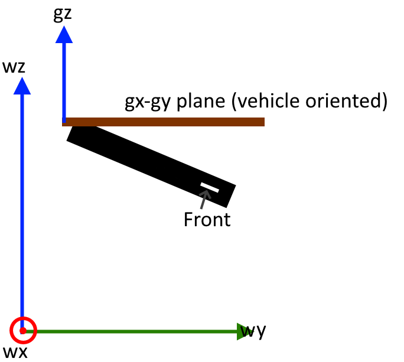

# Math

## Coordinate System Definition

The control board uses a coordinate system that is somewhat non-standard.

- The coordinate system is right handed
- `+y` is forward, `+z` is up, `+x` is right
- Pitch is about x, roll is about y, yaw is about z

<center>
{: style="height:250px;"}
{: style="height:250px;"}
{: style="height:250px;"}
</center>

While this coordinate system may seem strange to some (especially anyone who has worked with planes), the name of axes doesn't really matter.

## 6 Degree of Freedom Motion Control


### Nomenclature & Convention Notes

1. Matrices are assumed to be zero indexed (not 1 indexed). This means the first element of a matrix $M$ is $m_{00}$ not $m_{11}$. This is because the math will be implemented in C (which uses zero indexed arrays).
2. Thruster numbers (1-8) are used by the control board's user facing components. However, this math will use thruster indices (0-7) where `index = number - 1`. This is b
3. Rotations about axis (angular velocities / DoFs) are referred to as "xrot" (about x), "yrot" (about y), and "zrot" (about z).
4. The terms "pitch", "roll", and "yaw" are used to describe the vehicle's orientation in space. "Pitch" is angular velocity about the x-axis, "roll" is angular rotation about the y-axis, and "yaw" is angular velocity about the z-axis.
5. Velocities in DoFs are normalized (meaning -1.0 to 1.0).


### System Assumptions

- Vehicle is capable of motion exclusively in each of 6 degrees of freedom (DoFs). These are three translational DoFs, and three rotational DoFs.
- The vehicle's speed in positive and negative directions are roughly equal for each DoF.
- Thruster orientations are fixed. Gimbaled thruster vehicles are not supported.
- At most 8 thrusters (less is fine)
- System has 3D orientation information
- System has depth information
- System does **not** have translational position information


### Example Vehicle

The examples on this page will use AquaPack robotics's SeaWolf VIII robot. This robot's thruster configuration is as shown below. The arrows indicate the direction a thruster moves water (meaning the arrows are opposite the direction the thruster excerpts force on the vehicle).

<center>
{: style="height:400px;"}
</center>

The arrows indicate the direction the thruster moves water when powered in the positive direction. These arrows are opposite the direction force is excerpted on the vehicle. Note that the diagram above uses thruster numbers, not indices.

### DoF Matrix

The *DoF Matrix*, $D$, is constructed based on the vehicle's thruster configuration. Rows of the matrix correspond to thrusters (by index). And columns of the matrix correspond to vehicle relative DoFs. Thus, this is an 8x6 matrix. Columns correspond to DoFs in the following order (0-5): x, y, z, pitch, roll, yaw. Note that pitch, roll, and yaw are written using the single variable notation p, r, h (h = heading = yaw).

$D = \left(\begin{array}{c|c|c|c|c|c} d_0 & d_1 & d_2  & d_3 & d_4 & d_5 \end{array}\right) = \left(\begin{array}{c|c|c|c|c|c} d_x & d_y & d_z  & d_p & d_r & d_h \end{array}\right)$

Each column of the DoF matrix, $d_i$ is a set of thruster speeds that result in motion *exclusively* in the column's DoF. Additionally, the resultant motion should be the maximum possible speed, and in the positive direction. Each $d_i$ is an 8 element column vector, with elements corresponding to thrusters (by index). All speeds should be normalized (between -1.0 and 1.0)

For the example vehicle shown above, the following is the DoF matrix

$D = 
\begin{pmatrix}
-1 & -1 & 0 & 0 & 0 & +1 \\
+1 & -1 & 0 & 0 & 0 & -1 \\
-1 & +1 & 0 & 0 & 0 & -1 \\
+1 & +1 & 0 & 0 & 0 & +1 \\
0 & 0 & -1 & -1 & -1 & 0 \\
0 & 0 & -1 & -1 & +1 & 0 \\
0 & 0 & -1 & +1 & -1 & 0 \\
0 & 0 & -1 & +1 & +1 & 0 \\
\end{pmatrix}$

Consider the first column: $d_0 = d_x$. This column's thruster speeds should result in the vehicle moving as fast as possible in the +x direction (only). This is achieved by setting T2, T4 (index 1, 3) to the positive direction and T1, T3 (index 0, 2) to the negative direction at full speed (recall that the arrows are opposite the direction the thruster excerpts force on the vehicle). Thus

$d_x = \begin{pmatrix}-1 & +1 & -1 & +1 & 0 & 0 & 0 & 0\end{pmatrix}^T$

Note that when constructing the DoF matrix for your vehicle, you should assume an ideal system and environment.


### LOCAL Mode Motion

In LOCAL mode, motion is specified as a set of speeds in vehicle relative DoFs. The user provides the control board with a *local target motion vector* ($t_l$) where each element corresponds to a DoF.

$t_l = \begin{pmatrix} x & y & z & r_x & r_y & r_z \end{pmatrix}^T$

$x$ is normalized velocity in +x direction  
$y$ is normalized velocity in +y direction  
$z$ is normalized velocity in +y direction  
$r_x$ is normalized velocity in +pitch direction (xrot)
$r_y$ is normalized velocity in +roll direction (yrot)
$r_z$ is normalized velocity in +yaw direction (zrot)

By multiplying this target motion by the DoF matrix, $D$, a *speed vector* $s$ is obtained where each element of $s$ corresponds to a specific thruster (by index).

$s = D t_l$

Consider the example where $t_l = \begin{pmatrix}0 & 1 & 0 & 0 & 0 & 0\end{pmatrix}^T$. This should cause the vehicle to move at full possible speed forward (relative to the vehicle's orientation).

$s = D t_l = 
\begin{pmatrix}
-1 & -1 & 0 & 0 & 0 & +1 \\
+1 & -1 & 0 & 0 & 0 & -1 \\
-1 & +1 & 0 & 0 & 0 & -1 \\
+1 & +1 & 0 & 0 & 0 & +1 \\
0 & 0 & -1 & -1 & -1 & 0 \\
0 & 0 & -1 & -1 & +1 & 0 \\
0 & 0 & -1 & +1 & -1 & 0 \\
0 & 0 & -1 & +1 & +1 & 0 \\
\end{pmatrix}
\begin{pmatrix}0 \\ 1 \\ 0 \\ 0 \\ 0 \\ 0\end{pmatrix}
=
\begin{pmatrix}-1 \\ -1 \\ +1 \\ +1 \\ 0 \\ 0 \\ 0 \\ 0\end{pmatrix}$

In the above example, it is trivial to see that this is the desired motion. However for a more complex example, a problem appears. Consider $t_l = \begin{pmatrix}0 & 1 & 0 & 0 & 0 & 1\end{pmatrix}^T$. This describes the vehicle both moving forward and yawing at full possible speed.

$s = D t_l = 
\begin{pmatrix}
-1 & -1 & 0 & 0 & 0 & +1 \\
+1 & -1 & 0 & 0 & 0 & -1 \\
-1 & +1 & 0 & 0 & 0 & -1 \\
+1 & +1 & 0 & 0 & 0 & +1 \\
0 & 0 & -1 & -1 & -1 & 0 \\
0 & 0 & -1 & -1 & +1 & 0 \\
0 & 0 & -1 & +1 & -1 & 0 \\
0 & 0 & -1 & +1 & +1 & 0 \\
\end{pmatrix}
\begin{pmatrix}0 \\ 1 \\ 0 \\ 0 \\ 0 \\ 1\end{pmatrix}
=
\begin{pmatrix}0 \\ -2 \\ 0 \\ +2 \\ 0 \\ 0 \\ 0 \\ 0\end{pmatrix}$

Notice that the resultant speed vector has motors moving in excess of 100% speed (elements with magnitude greater than 1.0). This is not possible. While a simple solution may seem to be dividing all elements of the vector by the one with the largest magnitude. This results in a scaled speed vector $\hat{s}$

$\hat{s} = s \div \text{absmax}(s)$

this will not work well in all cases. Consider $t_l = \begin{pmatrix}0 & 1 & 1 & 1 & 1 & 1\end{pmatrix}^T$.

$s = D t_l = 
\begin{pmatrix}
-1 & -1 & 0 & 0 & 0 & +1 \\
+1 & -1 & 0 & 0 & 0 & -1 \\
-1 & +1 & 0 & 0 & 0 & -1 \\
+1 & +1 & 0 & 0 & 0 & +1 \\
0 & 0 & -1 & -1 & -1 & 0 \\
0 & 0 & -1 & -1 & +1 & 0 \\
0 & 0 & -1 & +1 & -1 & 0 \\
0 & 0 & -1 & +1 & +1 & 0 \\
\end{pmatrix}
\begin{pmatrix}0 \\ 1 \\ 1 \\ 1 \\ 1 \\ 1\end{pmatrix}
=
\begin{pmatrix}0 \\ -2 \\ 0 \\ +2 \\ -3 \\ -1 \\ -1 \\ +1\end{pmatrix}$

and

$\hat{s} = s \div \text{absmax}(s) = s \div 3 = \begin{pmatrix}0 \\ -0.67 \\ 0 \\ +0.67 \\ -1 \\ -0.33 \\ -0.33 \\ +0.33\end{pmatrix}$

While this has resulted in an possible set of thruster speeds, these are not optimal. Look at the example vehicle diagram. Notice that thrusters 1-4 and 5-8 control different motions. In the previous example, thrusters 1-4 were slowed down more than necessary, because thruster 5 was too large of a value. This is not ideal as the vehicle's maximum speed becomes artificially limited. Instead, the following $\hat{s}$ is ideal. This is scaling down the thrusters within each group (1-4 and 5-8) separately.

$\hat{s} = \begin{pmatrix}0 \\ -1 \\ 0 \\ +1 \\ -1 \\ -0.33 \\ -0.33 \\ +0.33\end{pmatrix}$

Groupings of thrusters on the example vehicle are easy to observe, however this is not always true. Thus, achieving optimal scaling for any system (any DoF matrix) requires a more sophisticated method to determine groupings and scale speeds.

Thruster groupings are determined by "overlap" between thrusters. Two thrusters, $i$ and $j$ are said to overlap if they have a non-zero entry in the same column of the DoF matrix ($D$) for at least one column. This is easier to calculate using a *contribution matrix*, $C$, defined as $D \neq 0$. This results in a binary form of the DoF matrix. For the above example

$C = 
\left[\begin{pmatrix}
-1 & -1 & 0 & 0 & 0 & +1 \\
+1 & -1 & 0 & 0 & 0 & -1 \\
-1 & +1 & 0 & 0 & 0 & -1 \\
+1 & +1 & 0 & 0 & 0 & +1 \\
0 & 0 & -1 & -1 & -1 & 0 \\
0 & 0 & -1 & -1 & +1 & 0 \\
0 & 0 & -1 & +1 & -1 & 0 \\
0 & 0 & -1 & +1 & +1 & 0 \\
\end{pmatrix}
\neq 0 \right] = 
\begin{pmatrix}
1 & 1 & 0 & 0 & 0 & 1 \\
1 & 1 & 0 & 0 & 0 & 1 \\
1 & 1 & 0 & 0 & 0 & 1 \\
1 & 1 & 0 & 0 & 0 & 1 \\
0 & 0 & 1 & 1 & 1 & 0 \\
0 & 0 & 1 & 1 & 1 & 0 \\
0 & 0 & 1 & 1 & 1 & 0 \\
0 & 0 & 1 & 1 & 1 & 0 \\
\end{pmatrix}$

Then for each thruster $i$ an overlap vector $o_i$ can be constructed as follows

$o_i = C (c^i)^T$

where $c^i$ is the $i$th row of $C$. Thus, $o_i$ is an 8 element vector where each element corresponds to a thruster (by index). Element $j$ of $o_i$ can either be $1$ or a $0$. $1$ indicates that thrusters $i$ and $j$ overlap.

For example, 

$o_0 = C (c^0)^T = \begin{pmatrix} 1 & 1 & 1 & 1 & 0 & 0 & 0 & 0 \end{pmatrix}^T$

This shows that thruster index 0 (T1) overlaps with indices 0, 1, 2, and 3 (T1, T2, T3, T4).

By calculating and storing these overlap vectors for each thruster ($\left\{o_i\right\}_{i=0}^7$), this effectively forms a lookup table to determine thruster overlap. While this is not the most memory efficient option, it reduces computation time, which is important since this will run very frequently on a microcontroller.

Using overlap vectors, the following algorithm can be used to scale motor speeds:

- Find the thruster (`i`) with the largest magnitude speed
- Iterate over thruster `i`'s overlap vector
- For any thruster `i` overlaps with (`j`), divide thruster `j`'s speed by the magnitude of thruster `i`'s speed
- Repeat until the largest magnitude does not exceed 1.0

```
while true
    // m is value, i is index
    m, i = max(abs(speed_vector))
    if m <= 1.0
        // Done scaling
        break
    endif

    // Iterate over all thrusters (0-7 inclusive)
    for j=0...7
        if overlap_vector[i][j] == 1
            // i and j overlap. Divide j's speed by m.
            speed_vector[j] /= m
        endif
    endfor
endwhile
```

This algorithm results in optimal speed scaling by only reducing the speed of thrusters that share DoF contributions.


### GLOBAL Mode Motion

GLOBAL mode is very similar to LOCAL mode, however, motion is described *partially* relative to the world instead of the robot. Specifically, motion of the vehicle is compensated for vehicle pitch and roll (but **not** yaw). This results in a coordinate system defined by the axes `gx`, `gy`, and `gz`. Note that the world coordinate system is defined as `wx`, `wy`, `wz`.




*Notably, if the vehicle is pitched 180 degrees, the gx-gy plane becomes aligned to the back of the vehicle ensuring consistent motion.*


<br />

In GLOBAL mode, the user provides the control board with a *global target motion vector*, $t_g$ with 6 elements. This target motion vector is a concatenation of two 3 dimensional vectors. The first, a set of translations along `gx`, `gy`, and `gz`. Second a set of rotations to affect vehicle pitch, roll, and yaw. These are referred to by the following names

- `x`: Speed in `gx` direction (translation)
- `y`: Speed in `gy` direction (translation)
- `z`: Speed in `gz` direction (translation)
- `p`: Speed at which the vehicle's pitch should increase (negative for decrease pitch). Aka "pitch_spd"
- `r`: Speed at which the vehicle's roll should increase (negative for decrease pitch). Aka "roll_spd"
- `h`: Speed at which the vehicle's yaw should increase (negative for decrease pitch). Aka "yaw_spd"

$t_g = \begin{pmatrix} x & y & z & p & r & h \end{pmatrix}$


It is necessary to transform each DoF's motion into motions in the vehicle's DoFs. These speeds can then be passed to LOCAL mode.

***WARNING:*** *GLOBAL mode is impacted by gimbal lock issues with euler angles. This occurs when the vehicle's pitch is +/- 90 degrees. In this scenario the meaning of "increase / decrease pitch" is ambiguous. The vehicle will take the zero-roll route in this scenario. Thus, GLOBAL mode may produce undesirable motion if the roll is non-zero and you pitch through +/- 90.*

<br />

**Translation DoFs:**

The translation DoFs are easily transformed using gravity vectors. By applying a quaternion based rotation matrix to the base gravity vector, $g_b = \begin{pmatrix}0 & 0 & -1\end{pmatrix}$, the following solution is determined for the current gravity vector, $g_c$ given the vehicle's orientation quaternion, $q$.

$\begin{pmatrix} 2*(q.x*q.z+q.w*q.y) \\  2*(q.w*q.x-q.y*q.z) \\ -(q.w)^2+(q.x)^2+(q.y)^2-(q.z)^2\end{pmatrix}^T$

The minimal rotation from $g_b$ to $g_c$ is then calculated. Let this rotation be called $q_{rot}$. *This rotation will generally include no yaw component, unless the vehicle is upside down and facing backwards (eg pitch of 180 degrees) in which case it will contain a yaw component of 180 degrees. This is desirable as it ensures a continuous definition of what `gy` is even while the vehicle is flipping via pitch.*

This quaternion can then be applied to speeds in the `gx`, `gy`, `gz` basis (`x`, `y`, and `z` here) to rotate them onto the vehicle basis. Thus, this "converts" translation speeds from GLOBAL to LOCAL mode DoFs.

However, it is not ideal to transform the translation vector all at once. It is best to do it in three stages to allow proper upscaling as needed (explained below).

Thus for each global mode translation vector $\begin{pmatrix} 0 & y & 0 \end{pmatrix}$, $\begin{pmatrix} 0 & 0 & z \end{pmatrix}$, and $\begin{pmatrix} x & 0 & 0 \end{pmatrix}$ rotate it by $q_{rot}$ to obtain $t_x$, $t_y$, and $t_z$ respectively (note that $\left\{s, v\right\}$ is a quaternion with scalar s and vector v).

$\left\{0, t_x\right\} = q_{rot} \left\{0, \begin{pmatrix} x & 0 & 0 \end{pmatrix} \right\} q_{rot}^*$

$\left\{0, t_y\right\} = q_{rot} \left\{0, \begin{pmatrix} 0 & y & 0 \end{pmatrix} \right\} q_{rot}^*$

$\left\{0, t_z\right\} = q_{rot} \left\{0, \begin{pmatrix} 0 & 0 & z \end{pmatrix} \right\} q_{rot}^*$

Each of $t_x$, $t_y$, and $t_z$ are speeds in LOCAL mode DoFs, however they may be slower than desired. Consider a speed of 1.0 along `gy`. If the vehicle were rotated 45 degrees (pitch) the resultant $t_y$ would be $t_y = \begin{pmatrix} 0.0 & 0.7071 & 0.7071 \end{pmatrix}$. This is not as fast as possible in the correct direction. Instead $t_y$ should be $t_y = \begin{pmatrix} 0.0 & 1.0 & 1.0 \end{pmatrix}$. In other words, the largest element of $t_y$ should be the speed along `gy`. Thus, each of $t_x$, $t_y$, $t_z$ needs to be upscaled (note that it will never need to be downscaled; it only needs to be upscaled because one DoF may now be spread between multiple).

- let $m$ be the magnitude of the element of $t_x$ with the largest magnitude
- Normalize $t_x$ so that largest element is 1.0: $t_x = t_x / m$
- Scale normalized $t_x$ by speed $x$ (gx speed): $t_x = t_x * x$
- Repeat this for $t_y$ and $t_z$ using $y$ and $z$ speeds respectively.

Once all three $t$ vectors are scaled, they can be combined to create the net LOCAL mode translation vector, $l$

$l = t_x + t_y + t_z$

There are two potential issues with $l$

1. $l$ is a set of proportionally related speeds to result in the desired motion. However, the vehicle may not be capable of the same speeds in each of it's DoFs. Thus, the ratios between $l$'s elements may be incorrect.
2. $l$ is a sum of three vectors (each with elements no larger than a magnitude of 1), thus it may have elements with a magnitude greater than 1.

Issue 1 should be handled first as correcting it may "fix" issue 2. Handling issue 2 first could result in downscaling speeds more than necessary.

Handling issue 1 requires the user to provide a little more information about the vehicle: relative speeds in each DoF. These can be used to calculate downscaling factors to slow down the faster directions (note: speeding up the slower directions would result in impossible speeds, but would be handled by solving issue 2; regardless it is less ideal).

These downscaling factors are calculated from "RELDOF" information provided by the user (see messages page of user guide). Here we will referr to the scale factors as $m_x$, $m_y$, $m_z$, $m_{rx}$, $m_{ry}$, and $m_{rz}$ for the x, y, z, xrot, yrot, and zrot DoFs respectively (note that these are vehicle DoFs).

Thus, the simplest option would be to let $l = \begin{pmatrix}l.x * m_x & l.y * m_y & l.z * m_z\end{pmatrix}$. However, this may downscale more than necessary. Consider the slowest direction to have a speed of 0 in l. In this case, since the slowest direction is unused, we are downscaling too much. Thus, the following algorithm is used to select the ideal downscaling factors by "ignoring" the downscaling required for unused DoFs (DoFs with a speed of 0).

```
// Zero downscale factors for unused DoFs
if abs(l.x) == 0
    m_x = 0
endif
if abs(l.y) == 0
    m_y = 0
endif
if abs(l.z) == 0
    m_z = 0
endif

// Rebalance scale factors so largest remaining is 1.0
m_max = max(m_x, max(m_y, m_z));
m_x = m_x / m_max;
m_y = m_y / m_max;
m_z = m_z / m_max;
```

$l$ is then downscaled as $l = \begin{pmatrix}l.x * m_x & l.y * m_y & l.z * m_z\end{pmatrix}$ using the scale factors calculated using the above algorithm.

Finally, issue 2 must be handled if any element of $l$ still has a magnitude greater than 1.0. Thus, 

- Let $m$ be the magnitude of the element of $l$ with the largest magnitude
- If $m$ is less than or equal to 1, do not change $l
- If $m$ is greater than 1 $l = l / m$

This resultant $l$ is a set of speeds that can be passed to LOCAL mode as it's `x`, `y`, and `z` speeds.

<br />

**Rotation DoFs:**

Converting the GLOBAL mode rotations (increase/decrease pitch, roll, yaw) to motions about DoFs is a little harder. It requires decomposing the quaternion into euler angles, then calculating three quaternions describing one euler rotation each. In other words, given the vehicle's current rotation $q$ we need to find $q_{pitch}$, $q_{roll}$ and $q_{yaw}$ such that (based on the euler angle convention used by the control board)

$q = q_{yaw} q_{pitch} q_{roll}$


This can be done by converting $q$ to a set of euler angles $e = \begin{pmatrix}pitch & roll & yaw\end{pmatrix}$ then constructing the following and converting each to a quaternion

$e_{pitch} = \begin{pmatrix}pitch & 0 & 0\end{pmatrix} \rightarrow q_{pitch}$

$e_{roll} = \begin{pmatrix}0 & roll & 0\end{pmatrix} \rightarrow q_{roll}$

$e_{yaw} = \begin{pmatrix}0 & 0 & yaw\end{pmatrix} \rightarrow q_{yaw}$

However, the euler angles obtained from $q$ may not be correct for this use case. An equivalent angle go $e$ (although improper) is $e_{alt} = \begin{pmatrix} \pi - pitch & roll - \pi & yaw - \pi \end{pmatrix}$. We need to compensate for first roll then pitch. Thus, we need the euler angle with minimal roll component. This will be referred to here as $e_b$ (which is either $e$ or $_{alt}$).

Then, given $s$ vectors describing motion to change the vehicle's pitch, roll, or yaw

$s_{pitch} = \begin{pmatrix}p & 0 & 0\end{pmatrix}$

$s_{roll} = \begin{pmatrix}0 & r & 0\end{pmatrix}$

$s_{yaw} = \begin{pmatrix}0 & 0 & h\end{pmatrix}$

We need to transform these onto the robot's axes as $w$ vectors. For roll this is trivial as roll is about the vehicle's y axis. For pitch, this requires undoing roll first (rotate by $q_{roll}*$) and for yaw this requires undoing roll then pitch. Thus

$w_{roll} = s_{roll}$

$\left\{0, w_{pitch}\right\} = q_{roll}^* \left\{0, s_{pitch}\right\} q_{roll}$

$\left\{0, w_{yaw}\right\}  = q_{pitch}^* q_{roll}^* \left\{0, s_{yaw}\right\} q_{roll} q_{pitch}$

These vectors are angular speeds about the vehicle's x, y, and z axes. Thus, just as for translations

- Upscale each $w$ vector using `p`, `r`, and `h` speeds (can skip for roll as this vector is never rotated)
- Sum the three $w$ vectors into a net $w$ vector
- Adjust $w$ for relative DoF speeds (using $m_{rx}$, $m_{ry}$, $m_{rz}$)
- Downscale $w$ if needed so all elements are less than 1

Then $w$ is the xrot, yrot, and zrot parts of the LOCAL mode target.


## Sensor Processing

TODO: Euler angle accumulation


## Other Derivations

TODO: Euler / Quaternion conversion

TODO: Gravity vector calculation

TODO: Angle between vectors

TODO: Min diff quat between two quats
