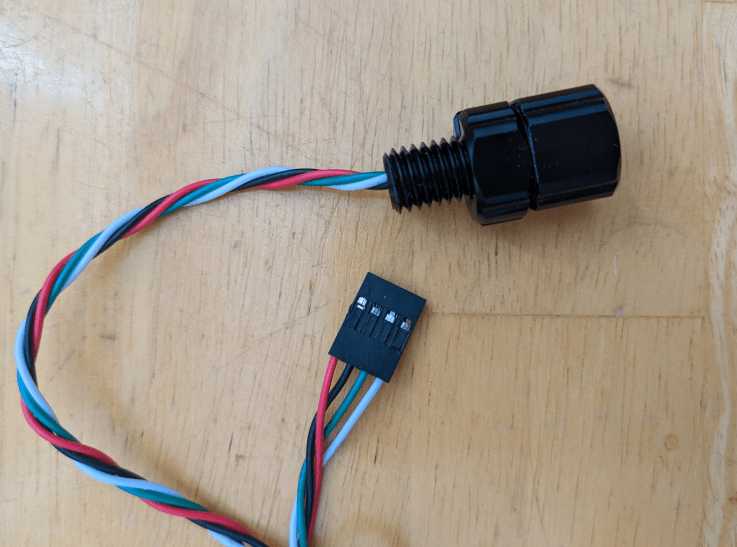

# Off-Board Sensors

The control board has an integrated IMU (gyro + accel) and is not designed to support off-board IMUs. However, for full functionality, vehicle depth data is also required. This data is provided by an off-board depth sensor. Currently, only one such sensor is supported: MS5837-30BA pressure sensor based depth sensors. The sensor used during development and tested with the control board is [BlueRobotics' Bar30 Sensor](https://bluerobotics.com/store/sensors-sonars-cameras/sensors/bar30-sensor-r1/).

The depth sensor is to be connected to the control board via the "Depth I2C" header. See the pinout images on the v1 or v2 hardware pages for more details. If using the BlueRobotics sensor, you will need to cut off the connector it comes with and install "DuPont" connectors.

