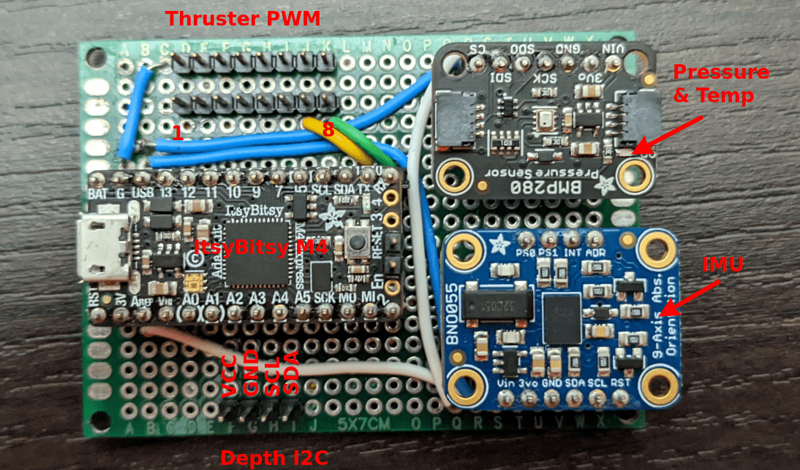
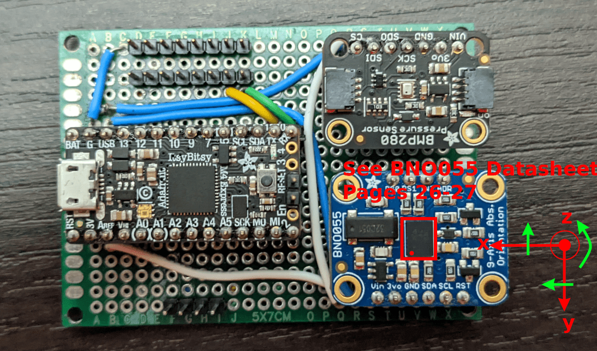
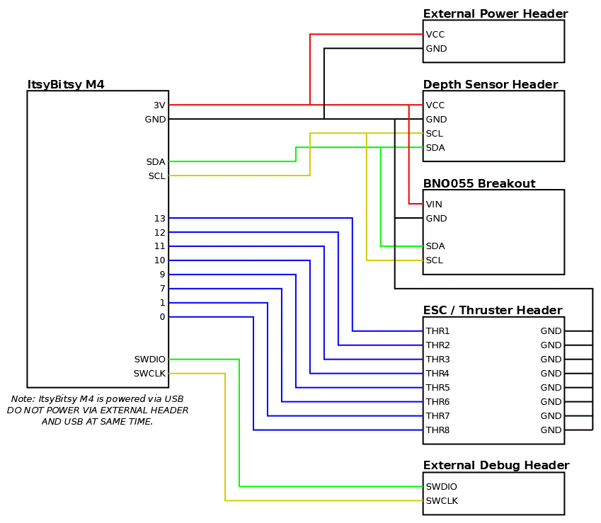
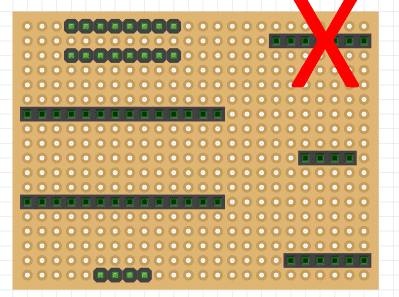
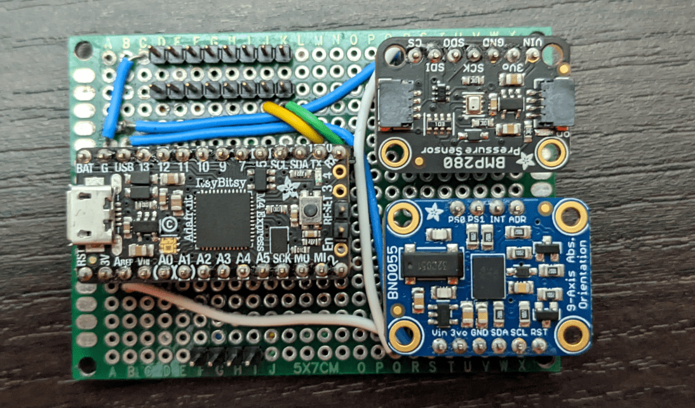
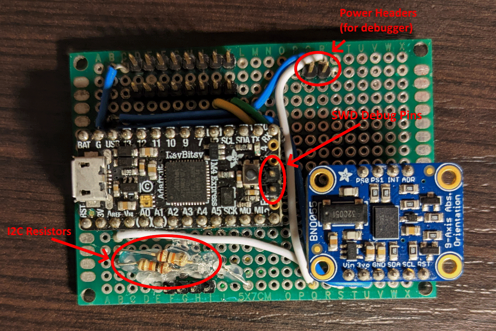
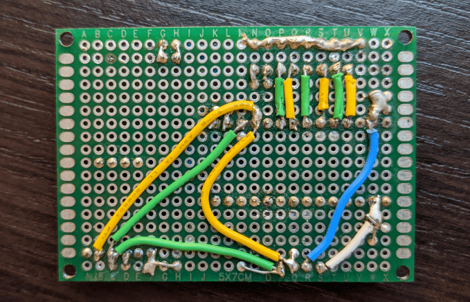

# AUV Control Board v1

*Note that some pictures show a version with a pressure / temperature sensor. This is no longer used and should not be included when building the board.*

The default coordinate system as defined by the IMU is shown below. Note that this is a right hand coordinate system. The red arrows define axes. Rotation about these axes is in the right hand direction (indicated by green arrows). Notice that the green arrows are on top of the red axis arrows, thus a "left to right" arrow is left to right across the top of the axis.

The axis configuration can be changed to match any plane-aligned mounting position of the control board on a robot. See the BNO055 datasheet for more information.

## Components

- 1x [Adafruit ItsyBitsy M4](https://www.adafruit.com/product/3800)
- 1x [Adafruit BNO055 Breakout](https://www.adafruit.com/product/2472)
    - [STEMMA QT version](https://www.adafruit.com/product/4646) can be substituted, however be aware that the pin order is different.
- Protoboard (2.54mm spacing; 24 by 18 holes; 5cm by 7cm)
    - These can be found from many vendors
- Solid Core Wire (22AWG)
- Female Pin Headers (2.54mm pitch)
    - Two 1x14 headers
    - One 1x6 header
    - One 1x4 header
    - Note: These can be cut between pins *carefully*
- Male pin headers (2.54mm pitch)
    - Two 1x8 headers
    - One 1x4 header
    - Two 1x2 headers (optional; for debug interface)
    - Note: These can easily be cut / broken between pins.
- Two 10K resistors (through hole, 1/4 W)

## Wiring Diagram

## Assembly Instructions

1. Solder header strips in the positions shown below. The female headers avoid soldering breakouts / dev boards directly to protoboard which allows easily replacing components if needed (or reusing them for other purposes later). After soldering, breakouts can be populated to make identifying pins easier. The crossed out header can be omitted as it was formerly used for the pressure / temp sensor (not used anymore).

    

2. Wire the protoboard according to the wiring diagram. Note that the first image shows the pressure / temperature sensor (this should be omitted). The first photo also does not show the pullup resistors or debug headers. The second picture is closer to what a fully assembled Control Board v1 should look like. Hot glue can be used to ensure the resistor leads do not short anything.

    *This photo is an older assembly that includes the temp / pressure sensor (should be omitted) and excludes the pullup resistors and debug headers (should be included).*

    

    *This photo shows the pullup resistors and debug headers*

    

    *Back side wiring*

    
