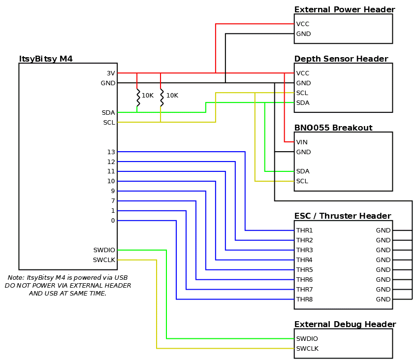

# AUV Control Board v1

*Note that some pictures show a version with a pressure / temperature sensor. This is no longer used and should not be included when building the board.*

The default coordinate system as defined by the IMU is shown below. Note that this is a right hand coordinate system. The red arrows define axes. Rotation about these axes is in the right hand direction (indicated by green arrows). Notice that the green arrows are on top of the red axis arrows, thus a "left to right" arrow is left to right across the top of the axis.

The axis configuration can be changed to match any plane-aligned mounting position of the control board on a robot. See the BNO055 datasheet for more information.

## Components

- 1x [Adafruit ItsyBitsy M4](https://www.adafruit.com/product/3800)
- 1x [Adafruit BNO055 Breakout](https://www.adafruit.com/product/2472)
    - [STEMMA QT version](https://www.adafruit.com/product/4646) can be substituted, however be aware that the pin order is different.
- Protoboard (2.54mm spacing; 24 by 18 holes; 5cm by 7cm)
    - These can be found from many vendors
- Solid Core Wire (22AWG)
- Female Pin Headers (2.54mm pitch)
    - Two 1x14 headers
    - One 1x6 header
    - One 1x4 header
    - Note: These can be cut between pins *carefully*
- Male pin headers (2.54mm pitch)
    - Two 1x8 headers
    - One 1x4 header
    - Two 1x2 headers (optional; for debug interface)
    - Note: These can easily be cut / broken between pins.
- Two 10K resistors (through hole, 1/4 W)

## Wiring Diagram

## Assembly Instructions

1. Solder header strips in the positions shown below. The female headers avoid soldering breakouts / dev boards directly to protoboard which allows easily replacing components if needed (or reusing them for other purposes later). After soldering, breakouts can be populated to make identifying pins easier. The crossed out header can be omitted as it was formerly used for the pressure / temp sensor (not used anymore).

    

2. Wire SDA and SCL wires from MCU board to each sensor as shown below (connect the two pins shown in each row).

    | Pin 1                      | Pin 2                    |
    | -------------------------- | ------------------------ |
    | ItsyBitsy SDA              | BNO055 SDA               |
    | ItsyBitsy SDA              | Depth SDA                |
    | ItsyBitsy SCL              | BNO055 SCL               |
    | ItsyBitsy SCL              | Depth SCL                |

3. Wire power and ground to each sensor as shown below. Power comes from USB on MCU dev board through builtin regulator.

    | Pin 1                      | Pin 2                    |
    | -------------------------- | ------------------------ |
    | ItsyBitsy 3V               | BNO055 VIN               |
    | ItsyBitsy 3V               | Depth VCC                |
    | ItsyBitsy GND              | BNO055 GND               |
    | ItsyBitsy GND              | Depth GND                |

4. Wire PWM signal header pins to GPIO pins on the dev board

    | Pin 1                      | Pin 2                    |
    | -------------------------- | ------------------------ |
    | ItsyBitsy 13               | PWM Signal 1             |
    | ItsyBitsy 12               | PWM Signal 2             |
    | ItsyBitsy 11               | PWM Signal 3             |
    | ItsyBitsy 10               | PWM Signal 4             |
    | ItsyBitsy 9                | PWM Signal 5             |
    | ItsyBitsy 7                | PWM Signal 6             |
    | ItsyBitsy 1                | PWM Signal 7             |
    | ItsyBitsy 0                | PWM Signal 8             |

    

5. While not shown in pictures above, it is recommended to add a 10K pullup resistor on both the SDA and SCL lines. For each line (SDA and SCL) connect one edge of the resistor to the line (SDA or SCL) and the other side to 3V. These are not strictly required as the IMU includes a level shifter on these pins with 10K pullups, but putting additional ones in parallel helps if power rail on IMU becomes noisy (usually due to touching the pins) or if the IMU is not populated. *This significantly reduces the number of I2C "glitches" that happened during development, thus is highly encouraged.*

6. If you want to interface with a debugger, it is recommended to add an extra VCC (3.3V) and GND pin (male) somewhere on the protoboard. Additionally, solder male pin headers to the SWDIO and SWCLK pins on the back edge of the ItsyBitsy M4.

    *The following image shows the recommended additions described in steps 5 and 6:*

    
