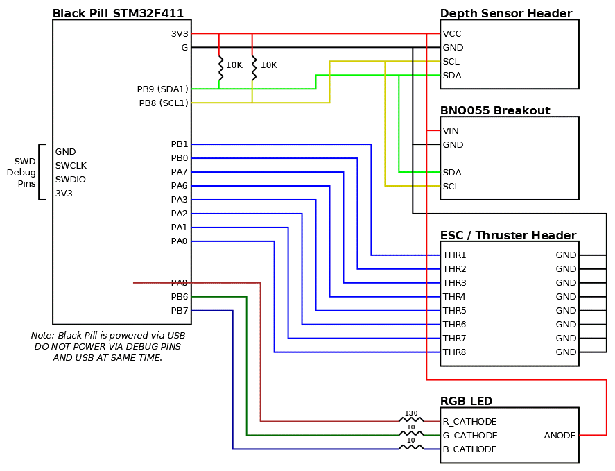

# AUV Control Board v2

TODO: Key pictures

## Components

- 1x WeAct Studio Black Pill (w / STM32F411 **notSTM32F401**)
    - *Note: There are many counterfeit boards sold. These should be avoided.*
    - [Adafruit Store](https://www.adafruit.com/product/3800)
    - [Aliexpress (Offical WeAct Studio Store)](https://www.aliexpress.com/item/3256801269871873.html)
- 1x [Adafruit BNO055 Breakout](https://www.adafruit.com/product/2472)
    - [STEMMA QT version](https://www.adafruit.com/product/4646) can be substituted, however be aware that the pin order is different.
- Protoboard (2.54mm spacing; 24 by 18 holes; 5cm by 7cm)
    - These can be found from many vendors
- Solid Core Wire (22AWG)
- Female Pin Headers (2.54mm pitch)
    - Two 1x20 headers
    - One 1x6 header
    - One 1x4 header
    - Note: These can be cut between pins *carefully*
- Male pin headers (2.54mm pitch)
    - Two 1x8 headers
    - One 1x4 header
    - Note: These can easily be cut / broken between pins.
- Resistors (through hole, 1/4 W)
    - Two 10K resistors
    - Two 10 Ohm resistors
    - One 130 Ohm resistor (can substitute a 100 ohm, or 120 ohm, but red channel of RGB LED will be slightly brighter)

## Wiring Diagram

## Assembly Instructions

TODO
