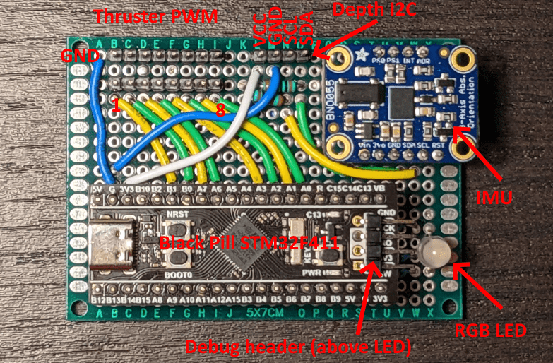
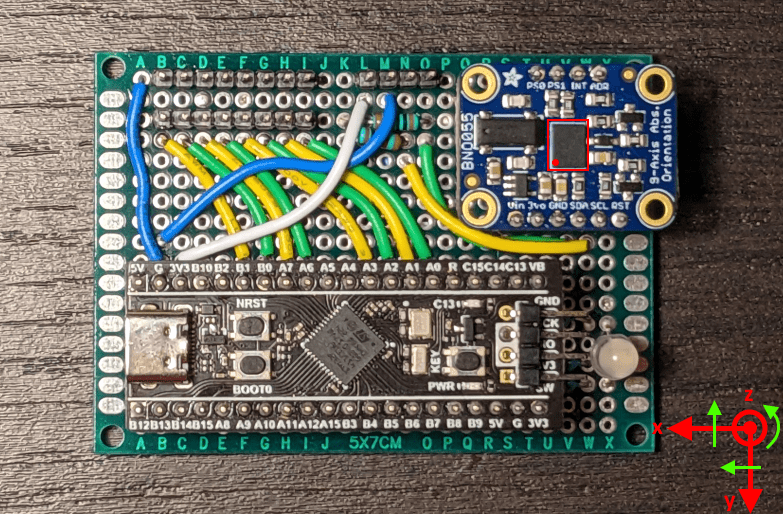
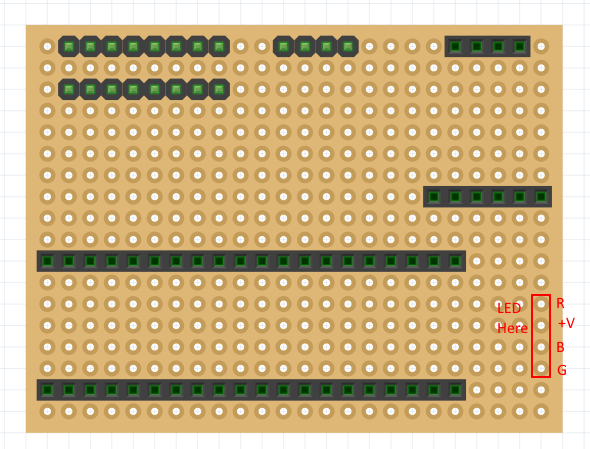
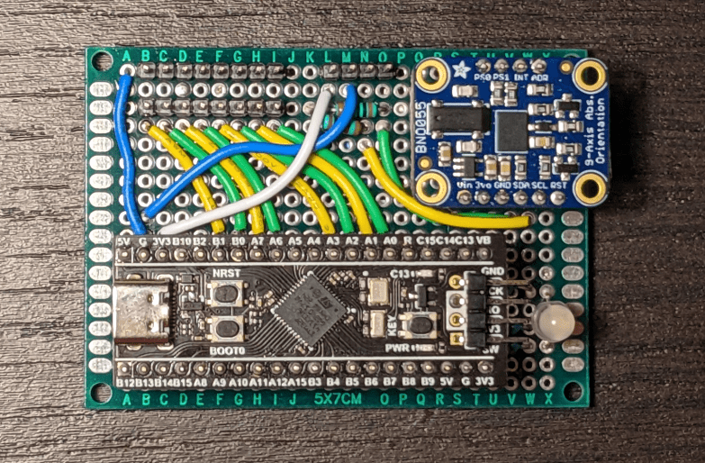
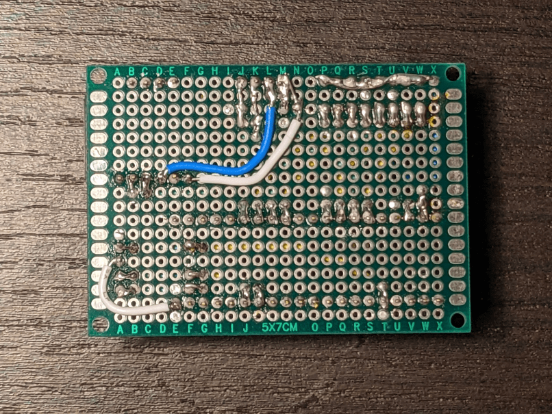

# AUV Control Board v2

The default coordinate system as defined by the IMU is shown below. Note that this is a right hand coordinate system. The red arrows define axes. Rotation about these axes is in the right hand direction (indicated by green arrows). Notice that the green arrows are on top of the red axis arrows, thus a "left to right" arrow is left to right across the top of the axis.

The axis configuration can be changed to match any plane-aligned mounting position of the control board on a robot. See the BNO055 datasheet for more information.

## Components

- 1x WeAct Studio Black Pill (w / STM32F411 **notSTM32F401**)
    - *Note: There are many counterfeit boards sold. These should be avoided.*
    - [Adafruit Store](https://www.adafruit.com/product/3800)
    - [Aliexpress (Offical WeAct Studio Store)](https://www.aliexpress.com/item/3256801269871873.html)
- 1x [Adafruit BNO055 Breakout](https://www.adafruit.com/product/2472)
    - [STEMMA QT version](https://www.adafruit.com/product/4646) can be substituted, however be aware that the pin order is different.
- Protoboard (2.54mm spacing; 24 by 18 holes; 5cm by 7cm)
    - These can be found from many vendors
- Solid Core Wire (22AWG)
- Female Pin Headers (2.54mm pitch)
    - Two 1x20 headers
    - One 1x6 header
    - One 1x4 header
    - Note: These can be cut between pins *carefully*
- Male pin headers (2.54mm pitch)
    - Two 1x8 headers
    - One 1x4 header
    - Note: These can easily be cut / broken between pins.
- Resistors (through hole, 1/4 W)
    - Two 10K resistors
    - Two 10 Ohm resistors
    - One 100 Ohm resistor
- One QBL8RGB60D0-2897 RGB LED

## Wiring Diagram

## Assembly Instructions

1. Solder header strips in the positions shown below. The female headers avoid soldering breakouts / dev boards directly to protoboard which allows easily replacing components if needed (or reusing them for other purposes later). After soldering, breakouts can be populated to make identifying pins easier. The location of the LED is also indicated here.

    

2. Wire the protoboard according to the wiring diagram.

    

    

