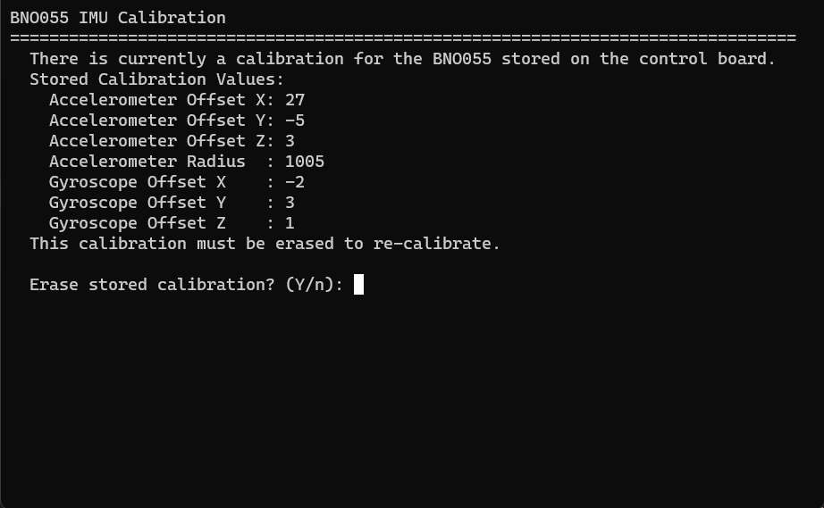
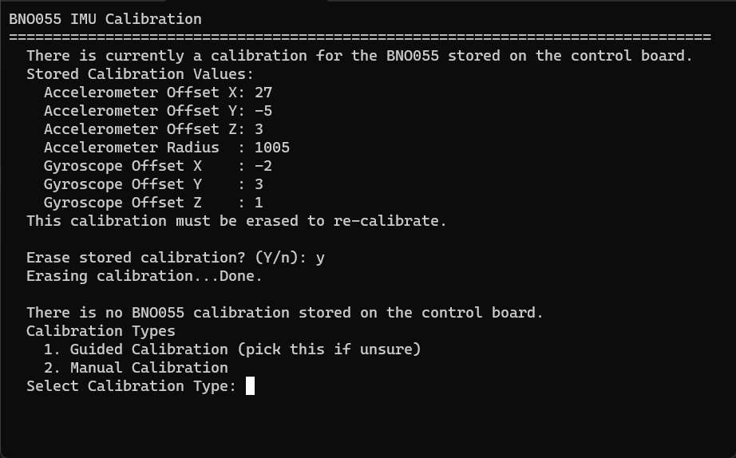
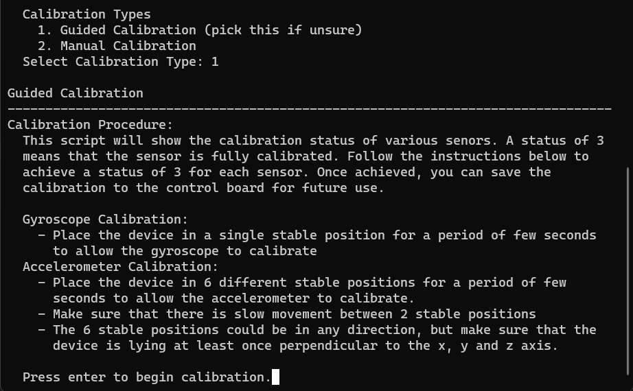
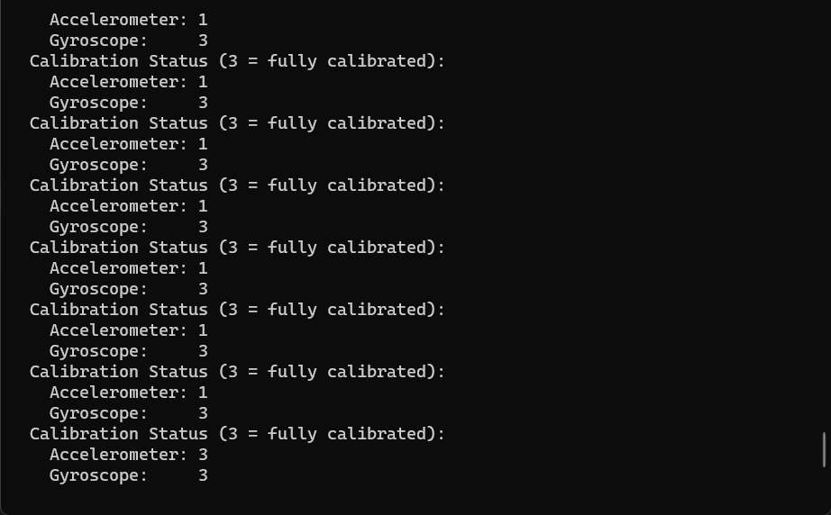
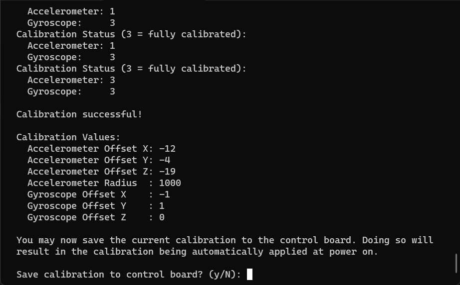

# Sensor Calibration

## BNO055 (IMU) Calibration

### Calibration Script

It is highly recommended to use the calibration script to calibrate the BNO055. Even if you are not using the python interface to the control board, the calibration script can be used to manage the calibration state.

Launch the script by using the following command (note that `python3` along with the `pyserial` library must be installed). Run this command in the `iface` folder. Replace `[PORT]` with the serial port of the control board.

```sh
python3 launch.py example/bno055_calibrate.py -p [PORT]
```

If a calibration is currently saved to the control board, the script will show that configuration and prompt you to erase it. **You must erase any stored configuration before you can recalibrate the BNO055.** Refusing to erase the calibration will result in the script exiting with no further action taken (this can be used as a way to view the currently saved calibration).



If the above prompt is not shown, there is no calibration currently saved on the control board.

Next, the script will prompt you to run either "guided" or "manual" calibration. Guided calibration provides instructions to use the BNO055's automatic calibration routine. This is recommended. Manual calibration allows a user to manually enter values for each calibration constant. Select guided mode.



Next, instructions on the calibration process will be provided. Read and follow the instructions. Then press enter to begin calibration.



The script will then periodically show you the calibration status of both sensor. Perform the described motions until the calibration status of both sensors shows as "3".



When both values show "3", the script will automatically retrieve the calibration generated by the BNO055. It will be shown and you will be prompted to save the calibration to the control board.



If you choose to save the calibration, it will be applied each time the control board resets or powers on until the calibration is erased or changed. **This is generally what you will want to do**.

Choosing not to save the calibration will not alter the calibration state of the device until reset. The BNO055 will retain it's calibration and re-running the calibration script (guided) will result in the calibration immediately being "good" (all sensors show "3"). However, resetting the control board (or power cycling it) will cause the calibration to be lost.

### Details

*This section provides details on how BNO055 calibration works. If attempting to implement a calibration routine yourself instead of using the calibration script, this information will be useful. Otherwise, probably not.*

The BNO055 IMU is calibrated using a set of "calibration constants". These constants can be stored to the control board so that they are applied to the sensor when the control board powers up.

If not calibration constants are stored on the control board, the IMU will instead run an automatic calibration routine in the background. This routine can be used to generate calibration constants for its sensors.

When a set of calibration constants is saved to the control board, they will be applied to the BNO055 each time the control board is powered on or is reset. When the control board applies a saved calibration to the BNO055, this disables the BNO055's automatic calibration routine. Thus, it is necessary to erase any calibration stored on the control board before recalibrating the BNO055. Note that the act of saving a calibration to or erasing a calibration from the control board will reconfigure the BNO055. Thus, saving a calibration to the control board will disable the BNO055's calibration routine whereas erasing a calibration from the control board will enable the BNO055's calibration routine. This means that a power cycle of the control board is **not** required after saving / erasing a calibration.

There are two places calibration constants could be located

- Saved on the control board (referred to as the stored calibration constants)
- On the BNO055 (referred to as the live calibration constants)

The stored calibration constants are written to the BNO055 when the control board starts. Thus, if any constants are saved, the live calibration constants will be the same as the stored calibration constants. However, if there are no stored calibration constants (they are erased or have never been stored), the live calibration constants will be generated by the BNO055's automatic calibration routine. The live calibration constants are only valid when the BNO055's calibration status register indicates a status code of `3` for each sensor in use (accelerometer and gyroscope).

The control board provides commands to manage both the stored calibration constants as well as read the live calibration constants and calibration status directly from the BNO055. The python interface scripts provide functions to do so as well. The `read_stored_bno055_calibration`, `erase_stored_bno055_calibration`, and `store_bno055_calibration` functions manage the stored calibration constants. The `bno055_read_calibration` and `bno055_read_calibration_status` functions will read the live calibration constants and the calibration status form the BNO055.

1. It is recommended to reset or power cycle the control board before starting calibration (important if no calibration is saved on the control board yet). This will ensure that any constants already generated by the BNO055's auto calibration routine are erased. If the constants are generated while the device is under various motions, the auto generated calibration may be bad. This step can be skipped if there is already a saved calibration as erasing the calibration will reconfigure the IMU and no auto generated constants will persist.
2. Erase any stored calibration. This will reset the IMU without applying any calibration. Thus, the live calibration constants will be generated by the BNO055's calibration routine.
3. Read the BNO055's calibration status register. Bitwise operations can be used to determine the calibration status of individual sensors. Each sensor is 2-bits of data. See the BNO055 datasheet for more information on the `CALIB_STAT` register. For the control board, only the accelerometer (ACC) and gyroscope (GYR) calibration status is relevant. Each of these will be a value from 0-3. A value of 3 indicates a good calibration.
4. Perform the required operations described in the BNO055 datasheet for gyro and accelerometer calibration. Once the BNO055's calibration status reads 3 for both sensors, the calibration is complete.
5. Read the live calibration constants from the BNO055
6. Store the calibration constants read in the previous step to the control board. The BNO055 will be reset, but the calibration will be applied. This same calibration that was stored to the control board will be applied to the BNO055 each time the control board is reset (or powered on).


### When to Re-Calibrate

You should always recalibrate if you change the physical sensor in use on the control board (swap a different BNO055) or if you are using a different control board. Calibration constants will vary between sensors, thus constants from one control board cannot be used on another. Likewise, if you change the sensor on your control board the old constants will no longer be valid.

Additionally, significant operating environment changes (pressure, temperature, elevation, etc) can cause enough of a change in sensor behavior to require re-calibration. Similarly, a change of the position of the sensor in the vehicle could require re-calibration. It is recommended to recalibrate if any such changes seem to result in degradation of sensor performance.

If the BNO055 axis configuration used by your vehicle changes, the BNO055 should be recalibrated.


## MS5837 (Depth Sensor) Calibration

The depth sensor is really just a pressure & temperature sensor. The depth is calculated using two "constant" values: the density of the water the vehicle is operating in and the atmospheric pressure at the surface of the water.

For the MS5837 atmospheric pressure must be provided in Pascals and the fluid density must be provided in kg / m^3. The default values are

- Atmospheric Pressure: 101325 Pa
- Fluid Density: 997 kg / m^3

These default values are applied on control board reset / power on. **MS5837 calibration is not persistent (it cannot be stored on the control board like the BNO055 can).**

These values can be adjusted using a command sent to the control board or by using the python interface script. The fluid density must be provided by the user (there is no good way to experimentally determine this on the vehicle). However, the pressure can be measured while the vehicle (and sensor) are in air at / above the surface.

The example interface script `ms5837_calibration.py` demonstrates calibration of the depth sensor.

**Again, since the calibration is not persistent it must be applied by command / interface script function each time the device is started.**

Note that depth sensor calibration is not persistent due to this being of limited use. The atmospheric conditions the vehicle is operating in will change with time. Thus, any persistent configuration would not be trusted and would be frequently overwritten.
