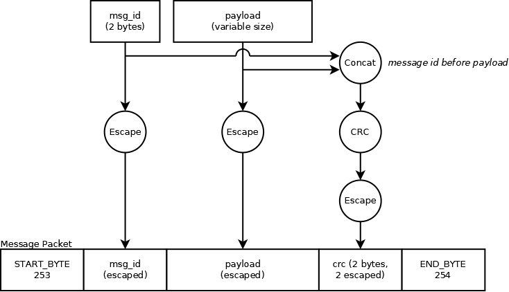

# Communication Protocol

Communication with the control board relies on sending messages between the control board and PC. This section focuses on how messages are sent, not what messages are sent.

## Hardware Communication Layer

Messages are sent to the control board over the MCU's builtin USB port. The control board acts as a USB ACM CDC device. In practice, this means that it shows up as a serial (UART) port on the computer it is connected to. However, baud rate settings are irrelevant (and changing baud rates has no effect). As such, messages are sent to / received from the control board using "UART" with an undefined baud rate&ast;. It is still necessary to set a baud rate when opening a UART port (as that information is provided to the device on the other side), but the rate is unused. Additionally, it is expected to operate in 8N1 data mode (8 data bits, no parity, 1 stop bit).

A stream of data is sent to the control board over this port. This data is interpreted as described below.

&ast; NOTE: The baud rate 1200 is an exception. Openening then closing the port at this baud rate is used to trigger the control board to reboot to its bootloader. Do not use 1200 baud!

## Message Format and Construction

The messages sent to / received from the control board have a specific format. Each message transfers a raw set of bytes (unsigned byte array). This set of bytes is the "payload data" of the message. The "payload data" is the data that is actually being send via the message. Messages are limited to a maximum payload size of 96 bytes.

To be able to identify what data is part of a single message, it is necessary to add some additional information around the payload. The control board uses a special byte to indicate the start of a message (`START_BYTE`) and another one to identify the end of a message (`END_BYTE`). 

Since the payload could itself contain a start or end byte, there is also an escape byte (`ESCAPE_BYTE`) used to escape a `START_BYTE`, `END_BYTE`, or an `ESCAPE_BYTE` in the payload. 

- `START_BYTE` becomes `ESCAPE_BYTE`, `START_BYTE`
- `END_BYTE` becomes `ESCAPE_BYTE`, `END_BYTE`
- `ESCAPE_BYTE` becomes `ESCAPE_BYTE`, `ESCAPE_BYTE`

This is similar to escaping a quote in a string using a backslash.

For the control board:

- `START_BYTE` = 253 (unsigned 8-bit) = -3 (signed 8-bit)
- `END_BYTE` = 254 (unsigned 8-bit) = -2 (signed 8-bit)
- `ESCAPE_BYTE` = 255 (unsigned 8-bit) = -1 (signed 8-bit)

In addition to the control bytes and the payload, each message contains two other pieces of information: 

- First, each message includes a prepended&ast; ID number (16-bit unsigned big-endian integer). These ID numbers are required to be unique **only in one direction**. This means that two messages sent from the PC to the control board cannot have the same id. Likewise, two messages sent from the control board to the PC cannot have the same id. However, a message sent from PC to control board **can** have the same id as another message sent from control board to PC.

    *Note that in practice, eventually (after 65535 messages sent one way) ID numbers must eventually repeat. This is acceptable as long as no two messages that are sent "close together" have the same id. Effectively, no two "active" messages in a single direction may have the same ID (what "active" means can vary, but in practice by the time 65,000 messages have been sent, old messages can be assumed inactive).*

- Second, each message has a CRC appended&ast; to it. This is a 16-bit CRC using the CCITT-FALSE algorithm. It is appended&ast; to the message big endian. The CRC is calculated on the concatenation of the message id bytes and the raw (unescaped) payload bytes.
- Just like the payload data, when prepending or appending message id or crc, it is necessary to escape bytes that are equal to control bytes (start, end, escape).

    &ast;*Note that append and prepend still mean contained between control (start and end) bytes.*

This results in message construction looking like the following (the "payload" is the raw message being sent).

