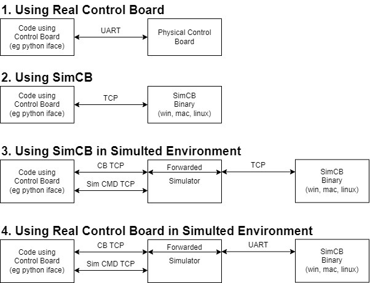

# Using SimCB and Simulator

TODO: Details and improvements in various sections.

TODO: Add port number info.

## SimCB

SimCB is a version of the control board firmware which is built as a binary that runs on Windows, macOS, or Linux. By running this binary, you can run the control board firmware on your computer without having a physical control board.

SimCB only supports simulator hijack mode (meaning only the sim IMU and depth sensors will work and thruster speeds will be reported back over comms interface). Instead of communicating with a physical control board via UART, you communicate with SimCB via TCP (the exact same messages are sent, just treat what you send over UART and TCP as byte streams). SimCB is a TCP server so code connecting to SimCB must be a TCP client.

TODO: How to use SimCB instead of real control board over uart (including instructions to run SimCB)

Using SimCB allows testing various aspects of communication with the control board and system behavior without having a physical control board.

## Simulator

The [simulator](https://github.com/MB3hel/GodotAUVSim) is a program that runs on your computer and models a vehicle in 3D space. The simulator hijacks a control board and provides the control board "fake" sensor data from the simulated environment. The control board then provides the simulator motor speeds so the simulator can move the vehicle appropriately in the simulated environment. When in this mode, user code should communicate with the simulator over TCP instead of communicating with the control board directly.

See the simulator's [README](https://github.com/MB3hel/GodotAUVSim/blob/main/README.md) for a description of how to communicate with the simulator. Note that the python iface scripts have builtin support for using the simulator.

The provided simulator (linked above) is fairly simple, and is mostly intended for development testing of the control board firmware. However, it can be useful to end users as well to see how the vehicle is expected to behave. Note thought that the environment provided in this simulator is very limited. For more complex use cases, users may wish to fork and adapt the simulator to their vehicles / use cases.

TODO: Instructions to run simulator and connect to real control board.

## Combining SimCB and Simulator

By combining the simulator (providing a simulated vehicle and environment) with SimCB (providing a control board without hardware), it is possible to test vehicle motion without any hardware (no vehicle in water and no real control board).

TODO: Instructions to run the simulator and connect to SimCB

## Ways to access Control Board

There are four general ways to use the control board

1. Directly using a real control board over UART (via USB)

2. Directly using SimCB over TCP

3. Using the simulator attached to a real control board (talking to the simulator over TCP)

4. Using the simulator attached to SimCB (talking to the simulator over TCP)

TODO: Discussion of these methods and when they are useful

## Advanced use Cases

1. End users can implement functionality in their own simulators to "hijack" a control board for simulation (referred to as "simhijack") just as the provided simulator does. When a control board is simhijacked, it does not use real sensors or create PWM signals for real thrusters. Instead, it communicates with a simulator. The control board gives the simulator motor speeds and the simulator is expected to provide the control board with sensor data. The protocol for doing so is fairly simple (see [messages](./messages.md) documentation) allowing end users to incorporate a control board into their own vehicle simulations.

2. End users may want to design unit tests that require communicating with a control board and validating motion. Unit test code can simhijack either a physical board or SimCB (probably more useful to use SimCB) and provide specific sensor inputs and commands and validate the motor outputs are as expected.

