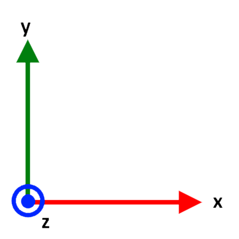

# AquaPack Robotics Control Board Math

`motor_control_math.py` is an implementation of the motor control math using numpy. It is used for prototyping / testing.

`motor_control_math.c` is a C implementation of the required math (can be used directly in embedded firmware later). *DOES NOT EXIST YET*

## Coordinate System Definition

- The coordinate system is defined by the images below
- Pitch is defined as rotation about the x-axis
- Roll is defined as rotation about the y-axis
- Yaw is defined as rotation about the z-axis
- Positive pitch, roll, and yaw are defined by the right hand rule
    - Point your right thumb in the positive direction of the axis being rotated about. The fingers of the hand curve in the direction of positive rotation. [Reference](https://en.wikipedia.org/wiki/Right-hand_rule)
    - Positive pitch is defined as counter-clockwise rotation in the yz plane when view from the +x side
    - Positive roll is defined as counter-clockwise rotation in the xz plan when view from the +y side
    - Positive yaw is defined as counter-clockwise rotation in the xy plane when viewed from the +z side

    
    
    

## Robot Local Coordinate System

- The robot's local coordinate system is defined as shown below where +y is forward, +x is right, and +z is up.
- Pitch and roll definitions remain the same as previously defined
    - +pitch raises front of the robot
    - +roll raises left of the robot
    - +yaw moves the front to the left

    

## Robot Thruster Arrangement

- The arrows on the diagrams below are the direction the thrusters push water when given a positive speed (meaning the force excreted on the robot is in the opposite direction).
- Note: Thruster numbers may not match SW8 exactly. This can be addressed later by adjusting motor numbers in the motor matrix (will be explained later).
- Note: Directions of arrows may be incorrect for positive speed on some thrusters. Inverting sign of speed per motor as needed in software can correct this.

    

## 6DOF Motor Math

The following section covers math to calculate individual motor speeds to achieve the desired motion with a 6 degree of freedom system (6DoF = 3 translation and 3 rotation). The math remains valid for motor configurations where motion in some DoFs is not possible.

### Motor Matrix

The motor matrix is generated based on physical frame and thruster configuration. The motor matrix associates motor numbers with their contributions to motion in different degrees of freedom.

The motor matrix can be thought of as a "table" where each column represents one degree of freedom and each row represents a motor. Each column is a set of motor speeds that cause motion **only** in the column's degree of freedom (and in the positive direction and at maximum possible speed). There are always 7 columns in the matrix. The number of rows is equal to the number of motors. Note that the motor numbers can be in any order (ie row order does not matter) whereas columns must be ordered as shown in the image below.

    

To construct the motor matrix for a given thruster configuration, work one column at a time (after assigning motor numbers to rows). For each column determine the speeds for each motor to cause motion **only** in the positive direction of the column's DoF at the maximum possible speed. The motor speeds in each column must not cause motion in any other DoF (in an ideal scenario; in the real world things are never perfect). Note that all motor speeds are specified as a number between negative one and positive one.

The motor matrix for the thruster configuration shown above is as follows

    

### DoF Matrix

The motor matrix is not directly used in calculations. Only a subset of it is. The DoF Matrix is a submatrix of the motor matrix excluding the first column (motor numbers). This matrix is used for all calculations. The motor number column is extracted and stored as a column vector and used to associate speed calculation results with the correct motor numbers after other calculations.

    

### Local Targets

Next it is necessary to define a motion target, or a goal for the robot's motion in each DoF. For now, assume this target is relative to the robot, not the world (meaning the robot's orientation in space is irrelevant).

A motion target is a column vector where each row corresponds to a DoF (order matches order of DoFs in motor matrix columns). The value in each cell is a number from negative one to positive one and represents the target speed in each degree of freedom. The target can have motion in as many DoFs as desired. 

    

This target motion vector can then be used to calculate individual motor speeds by multiplying it by the DoF matrix. The result of this multiplication is a column vector with as many entries as there are motors. Each entry is a motor speed. The motor speeds are in the same order as the motor number column vector (first column of motor matrix).

    

Motion in multiple DoFs can be used to create any net motion the robot is capable of. For example, positive y translation and positive yaw of equal magnitudes (speeds) will result in the robot moving in a circle in the xy plane about the left edge of the robot (positive directions). The calculation for this scenario is shown below (at 100% speed).

    

Notice that the resultant motor speed vector has motor speeds that exceed 100% speed. This is because it is not possible to move at 100% speed in both of the specified DoFs at the same time. As such, motor speeds will need to be scaled down. This is discussed in the next section.

### Scaling Motor Outputs

TODO

Note: the method currently implemented in the python code is "valid" for the specific configuration, but likely not generally applicable. This needs to be reconsidered.

### Global Targets

TODO
