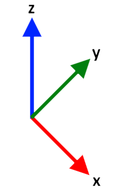
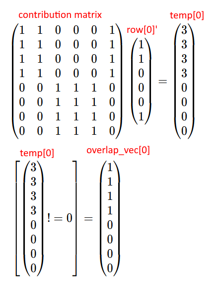

# AquaPack Robotics Control Board Math

`motor_control_math.py` is an implementation of the motor control math using numpy. It is used for prototyping / testing.

`c_math` is a C implementation of the required math (can be used directly in embedded firmware later).


## Coordinate System Definition

- The coordinate system is defined by the images below
- Pitch is defined as rotation about the x-axis
- Roll is defined as rotation about the y-axis
- Yaw is defined as rotation about the z-axis
- Positive pitch, roll, and yaw are defined by the right hand rule
    - Point your right thumb in the positive direction of the axis being rotated about. The fingers of the hand curve in the direction of positive rotation. [Reference](https://en.wikipedia.org/wiki/Right-hand_rule)
    - Positive pitch is defined as counter-clockwise rotation in the yz plane when view from the +x side
    - Positive roll is defined as counter-clockwise rotation in the xz plan when view from the +y side
    - Positive yaw is defined as counter-clockwise rotation in the xy plane when viewed from the +z side

<p align="center">
    
    
    
</p>


## Robot Local Coordinate System

- The robot's local coordinate system is defined as shown below where +y is forward, +x is right, and +z is up.
- Pitch and roll definitions remain the same as previously defined
    - +pitch raises front of the robot
    - +roll raises left of the robot
    - +yaw moves the front to the left

<p align="center">
    
</p>


## Robot Thruster Arrangement

- The arrows on the diagrams below are the direction the thrusters push water when given a positive speed (meaning the force excreted on the robot is in the opposite direction).
- Note: Thruster numbers may not match SW8 exactly. This can be addressed later by adjusting motor numbers in the motor matrix (will be explained later).
- Note: Directions of arrows may be incorrect for positive speed on some thrusters. Inverting sign of speed per motor as needed in software can correct this.

<p align="center">
    
</p>


## 6DOF Motor Math

The following section covers math to calculate individual motor speeds to achieve the desired motion with a 6 degree of freedom system (6DoF = 3 translation and 3 rotation). The math remains valid for motor configurations where motion in some DoFs is not possible.


### Motor Matrix

The motor matrix is generated based on physical frame and thruster configuration. The motor matrix associates motor numbers with their contributions to motion in different degrees of freedom.

The motor matrix can be thought of as a "table" where each column represents one degree of freedom and each row represents a motor. Each column is a set of motor speeds that cause motion **only** in the column's degree of freedom (and in the positive direction and at maximum possible speed). There are always 7 columns in the matrix. The number of rows is equal to the number of motors. Note that the motor numbers can be in any order (ie row order does not matter) whereas columns must be ordered as shown in the image below.

<p align="center">
    
</p>

To construct the motor matrix for a given thruster configuration, work one column at a time (after assigning motor numbers to rows). For each column determine the speeds for each motor to cause motion **only** in the positive direction of the column's DoF at the maximum possible speed. The motor speeds in each column must not cause motion in any other DoF (in an ideal scenario; in the real world things are never perfect). Note that all motor speeds are specified as a number between negative one and positive one.

The motor matrix for the thruster configuration shown above is as follows

<p align="center">
    
</p>


### DoF Matrix

The motor matrix is not directly used in calculations. Only a subset of it is. The DoF Matrix is a submatrix of the motor matrix excluding the first column (motor numbers). This matrix is used for all calculations. The motor number column is extracted and stored as a column vector and used to associate speed calculation results with the correct motor numbers after other calculations.

<p align="center">
    
</p>


### Local Targets

Next it is necessary to define a motion target, or a goal for the robot's motion in each DoF. For now, assume this target is relative to the robot, not the world (meaning the robot's orientation in space is irrelevant).

A motion target is a column vector where each row corresponds to a DoF (order matches order of DoFs in motor matrix columns). The value in each cell is a number from negative one to positive one and represents the target speed in each degree of freedom. The target can have motion in as many DoFs as desired. 

<p align="center">
    
</p>

This target motion vector can then be used to calculate individual motor speeds by multiplying it by the DoF matrix. The result of this multiplication is a column vector with as many entries as there are motors. Each entry is a motor speed. The motor speeds are in the same order as the motor number column vector (first column of motor matrix). This vector is the speed vector.

<p align="center">
    
</p>

Motion in multiple DoFs can be used to create any net motion the robot is capable of. For example, positive y translation and positive yaw of equal magnitudes (speeds) will result in the robot moving in a circle in the xy plane about the left edge of the robot (positive directions). The calculation for this scenario is shown below (at 100% speed).

<p align="center">
    
</p>

Notice that the resultant motor speed vector has motor speeds that exceed 100% speed. This is because it is not possible to move at 100% speed in both of the specified DoFs at the same time. As such, motor speeds will need to be scaled down. This is discussed in the next section.


### Scaling Motor Outputs

The above example illustrates the need to scale down motor speeds. However, doing so is less trivial than it may initially appear.

The most intuitive option would be to divide all motor speeds by the largest magnitude (`m = max(abs(speed_vector))`) if `m` is larger than 1.0 (no need to divide if no value is larger than 1 because the motion is already possible). This solution works in the above example resulting in the following scaled speed vector

<p align="center">
    
</p>

While this is the correct result for the above example, consider the following more complex example (where motion in more DoFs is added).

<p align="center">
    
</p>

If the previously described algorithm is applied `m = 3` which results in the following scaled speed vector

<p align="center">
    
</p>

However, this speed vector is scaled non-optimally. Notice that the maximum speed occurred at motor 5. However, motors 1, 2, 3, and 4 do not affect any of the same directions as motor 5. As such, it is not necessary to divide motor 1, 2, 3, 4 speeds by 3. Instead they should only be divided by 2 otherwise some DoF motions are slowed more than required (artificially reducing max speed).

In reality, it is only necessary to divide the speeds of some motors depending on where the max speed is located. If the max speed occurs at motor *i*, it is only necessary to divide the speed of any motors that "overlap" with motor *i*. Overlap is defined as sharing a contribution in any DoF. In terms of the DoF matrix, two motors *i* and *j* overlap if the row for motor *i* and the row for motor *j* have a non-zero entry in the same column for at least one column. Mathematically, this is easier to calculate if a contribution matrix is defined as "the dof matrix is not equal to zero". The contribution matrix is a "binary version" of the dof matrix, where any non-zero entry in the dof matrix becomes a 1 in the contribution matrix (and any zero remains a zero). 

<p align="center">
    
</p>

Then, in terms of the contribution matrix, two motors *i* and *j* overlap if the row for motor *i* and motor *j* have a one entry in the same column for at least one column. Mathematically, the number of shared non-zero entries is the dot product of the two rows.

To simplify later calculations an overlap vector will be generated for each motor in the dof matrix. The overlap vector is a vector of 1's and 0's indicating whether overlap occurs with the corresponding index motor in the speed vector. For motor i the overlap vector (`overlap_vec[i]`) is defined as "the product of the contribution matrix and the transpose of row `i` of the contribution matrix is not equal to zero". For example `overlap_vec[0]` is defined as follows

<p align="center">
    
</p>

One overlap vector must be calculated for *each* motor. These are calculated ahead of time to reduce the number of operations that must be performed to calculate motor speeds (important when this is implemented on a microcontroller).

Finally, the following algorithm (described in pseudocode) is used to properly scale each motor. The scaling is done when no speed in the vector has a magnitude greater than 1.

```
while true
    // index is index in speed_vector at which m occurs
    m, index = max(abs(speed_vector))
    if m <= 1
        // No speeds exceed max magnitude, so done scaling
        break
    endif

    // Scale speed_vector as needed
    for i = 0; i < length(overlap_vector[index]); ++i
        if overlap_vector[index][i] == 1
            speed_vector[i] /= m;
        endif
    endfor
endfor
```

Using this algorithm the earlier example results in the following scaled speed vector (which is optimal for the requested motions).

<p align="center">
    
    <br />
    <i>Motor 1, 2, 3, 4 speeds divided by 2 and motor 5, 6, 7, 8 speeds divided by 3. This results in the fastest motor within each group being at 100% speed, thus this is optimal scaling.</i>
</p>


### Global Targets

Instead of providing desired motion relative to the robot's orientation, it is often easier to specify motion relative to the world (at least partially). This requires knowing information about the robot's orientation in 3D space. However, for this application the robot's heading will be ignored (meaning x and y are relative to the robot's orientation, but z is world-relative). 

This effectively turns the target vector previously provided into a pseudo world-relative motion target (DoFs are world coordinate system DoFs not robot coordinate system DoFs). *However, y still means forward relative to robot heading **not** relative to the world coordinate system (same idea for x too).*

This method is used instead of a true global target for two reasons
- The method described above does not require knowing the robot's heading in 3D space. As such, the required information can be entirely obtained using an accelerometer. No use of gyroscope or magnetometer is required. This is beneficial as gyroscopes drift and magnetometers become unreliable in close proximity to motors.
- Missing code's knowledge of the robot's position relative to objects of interest often has no knowledge of a world coordinate system. As such, keeping x and y translations robot-relative simplifies mission code and reduces errors for closed loop control in mission code.

The target vector can be split into two parts: a translation vector and a rotation vector.

<p align="center">
    
</p>

Both vectors are in an [x, y, z] order.
- Translations are along the given axes
- Rotations are about the given axes

The idea is to determine a rotation matrix to translate the world gravity vector to the robot's measured gravity vector. This is the same rotation that should then be applied to each of the vectors described above (translation and rotation).

It is assumed that when the robot's coordinate frame matches the world's coordinate frame, the measured gravity vector will be [0, 0, -g] (meaning in the negative z direction). This must be configured to be the case (IMU supports axis remapping internally to allow this regardless of how the IMU is mounted). Then, given a world gravity vector (`g_w`) and a measured gravity vector `g_r` a rotation matrix (`R`) to rotate vectors from the world coordinate system into the robot's coordinate system can be calculated as shown below

<p align="center">
    
</p>

Where `[v_c]_x` is the skew symmetric cross product matrix of `v_c` defined as follows

<p align="center">
    
</p>

Then each of the translation and rotation targets can be rotated by multiplication by the rotation matrix (`R`). The translation and rotation vectors are then concatenated to create the full local target vector.

<p align="center">
    
</p>
